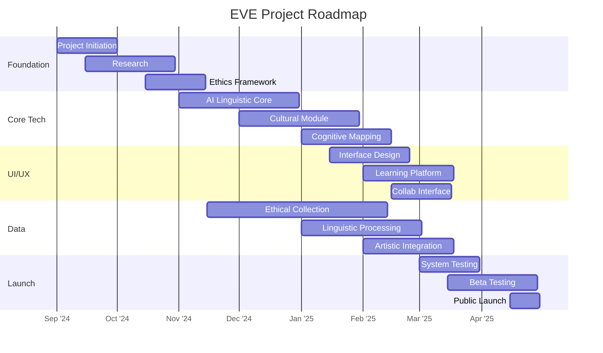

Explanation of the Gantt chart:

This Gantt chart provides a visual representation of the EVE project roadmap over a period of approximately 8 months. Here are the key elements and how to interpret the chart:

1. **Project Phases**: The chart is divided into five main sections, each representing a major phase of the project:
   - Foundation and Research
   - Core Technology Development
   - User Interface and Experience
   - Data Collection and Integration
   - Testing and Launch

2. **Tasks**: Each row within a section represents a specific task or milestone in the project. For example, "Project Initiation & Team Assembly" is the first task in the Foundation and Research phase.

3. **Timeline**: The horizontal axis represents time, with dates formatted as YYYY-MM-DD. The project starts on 2024-01-01 and concludes with the public launch on 2024-08-30.

4. **Task Duration**: The length of each bar indicates the duration of the task. For instance, the "AI-Driven Linguistic Core" development is scheduled to take 60 days.

5. **Task Dependencies**: Some tasks start after the completion of others, indicating dependencies. For example, "System Testing" begins after the completion of core development and data integration tasks.

6. **Parallel Tasks**: Many tasks run concurrently, such as "Immersive Cultural Module" and "Ethical Data Collection," showing the project's complexity and the need for parallel workstreams.

7. **Color Coding**: Each project phase is represented by a different color, making it easy to distinguish between different areas of work at a glance.
