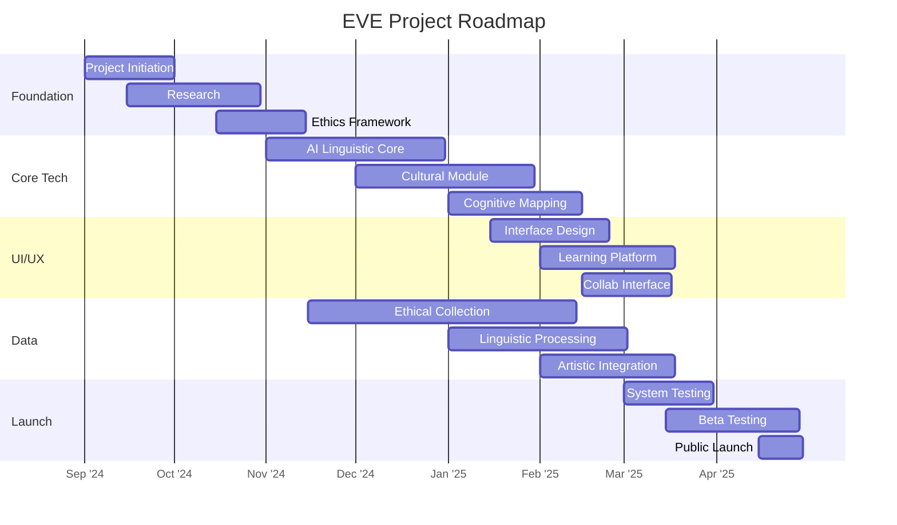
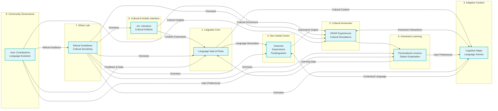
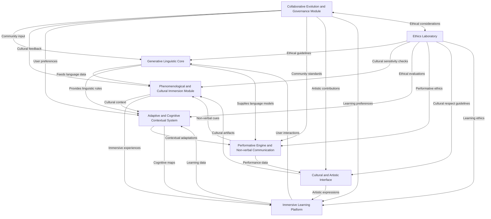

# Repository Content

## ./GanttChart.md




## Explanation of the Gantt chart:

This Gantt chart provides a visual representation of the EVE project roadmap over a period of approximately 8 months. Here are the key elements and how to interpret the chart:

1. **Project Phases**: The chart is divided into five main sections, each representing a major phase of the project:
   - Foundation and Research
   - Core Technology Development
   - User Interface and Experience
   - Data Collection and Integration
   - Testing and Launch

2. **Tasks**: Each row within a section represents a specific task or milestone in the project. For example, "Project Initiation & Team Assembly" is the first task in the Foundation and Research phase.

3. **Timeline**: The horizontal axis represents time, with dates formatted as YYYY-MM-DD. The project starts on 2024-01-01 and concludes with the public launch on 2024-08-30.

4. **Task Duration**: The length of each bar indicates the duration of the task. For instance, the "AI-Driven Linguistic Core" development is scheduled to take 60 days.

5. **Task Dependencies**: Some tasks start after the completion of others, indicating dependencies. For example, "System Testing" begins after the completion of core development and data integration tasks.

6. **Parallel Tasks**: Many tasks run concurrently, such as "Immersive Cultural Module" and "Ethical Data Collection," showing the project's complexity and the need for parallel workstreams.

7. **Color Coding**: Each project phase is represented by a different color, making it easy to distinguish between different areas of work at a glance.


## ./README.md

# EVE Project (Écosystème linguistique Virtuel Évolutif)

## About EVE

The Evolving Virtual Linguistic Ecosystem (EVE) project is a revolutionary initiative aimed at preserving and evolving human expression in all its diversity. In a world where a language dies every two weeks, EVE stands as a guardian of cognitive and cultural wealth, using cutting-edge technology to safeguard unique ways of perceiving, thinking, and interacting with our environment.

For a comprehensive overview of the project, visit our [Wiki Home Page](https://github.com/Git-Fg/Eve_Project/wiki/home).



## Objective

Our fundamental goal is to create a dynamic linguistic ecosystem that captures not only words but also the cultural contexts, gestures, tones, and even the silences that give life to a language. We aim to:

- Preserve and revitalize endangered languages
- Create immersive learning experiences
- Facilitate ethical and collaborative linguistic evolution
- Develop a deeper understanding of the relationship between language, culture, and cognition

Learn more about our [Vision and Objectives](https://github.com/Git-Fg/Eve_Project/wiki/Vision-and-Objectives).

## Project Roadmap


[This development plan is in alpha and subject to change]

For a detailed breakdown of our project phases, visit our [[Project Roadmap](https://github.com/Git-Fg/Eve_Project/wiki/Project-Roadmap)] wiki page.

## Key Components

1. Generative and culturally anchored linguistic core
2. Phenomenological and cultural immersion module
3. Adaptive and cognitive contextual system
4. Performative engine and non-verbal communication
5. Cultural and artistic interface
6. Immersive learning and dialectal variation platform
7. Linguistic and cultural ethics laboratory
8. Collaborative evolution and community governance module

Explore our [Project Architecture](https://github.com/Git-Fg/Eve_Project/wiki/Project-Architecture) for more details on these components.

## Guiding Principles

1. Cultural authenticity
2. Inclusivity and diversity
3. Ethics and respect
4. Adaptability and vitality
5. Transparency and participation
6. Holistic preservation
7. Linguistic equity

Read more about our ethical approach in our [Ethical Framework](https://github.com/Git-Fg/Eve_Project/wiki/Ethical-Framework).

## Get Involved

We invite linguists, technologists, philosophers, and cultural guardians to join us in this extraordinary quest to redefine and enrich our understanding of what it means to be human. Together, we can create a living linguistic tapestry that honors the diversity of human thought.

For more information on how to contribute, please see our [Contributing Guidelines](https://github.com/Git-Fg/Eve_Project/wiki/Contributing-Guidelines) and [Community Engagement](https://github.com/Git-Fg/Eve_Project/wiki/Community-Engagement) pages.

## Research and Publications

Stay updated with our latest research and academic contributions on our [Research and Publications](https://github.com/Git-Fg/Eve_Project/wiki/Research-and-Publications) page.

## FAQ

For answers to common questions about the EVE project, visit our [FAQ](https://github.com/Git-Fg/Eve_Project/wiki/FAQ) page.

## License

[TODO: Add license information]

## Contact

[TODO: Add contact information]

For a glossary of terms used in this project, refer to our [Glossary](https://github.com/Git-Fg/Eve_Project/wiki/Glossary) page.


## ./CODE_OF_CONDUCT.md

# Code of Conduct for EVE (Écosystème linguistique Virtuel Évolutif)

## Our Pledge

In the interest of fostering an open, welcoming, and culturally diverse environment, we as contributors and maintainers pledge to make participation in our project and our community a harassment-free experience for everyone, regardless of age, body size, disability, ethnicity, sex characteristics, gender identity and expression, level of experience, education, socio-economic status, nationality, personal appearance, race, religion, or sexual identity and orientation.

We pledge to respect and celebrate the rich tapestry of human linguistic and cultural diversity that forms the core of the EVE project, as outlined in our [Vision and Objectives](https://github.com/Git-Fg/Eve_Project/wiki/Vision-and-Objectives).

## Our Standards

Examples of behavior that contributes to creating a positive environment include:

* Using welcoming and inclusive language
* Being respectful of differing viewpoints and experiences
* Gracefully accepting constructive criticism
* Focusing on what is best for the community and the preservation of linguistic diversity
* Showing empathy towards other community members and the cultures they represent
* Adhering to our [Ethical Framework](https://github.com/Git-Fg/Eve_Project/wiki/Ethical-Framework) in all interactions

Examples of unacceptable behavior by participants include:

* The use of sexualized language or imagery and unwelcome sexual attention or advances
* Trolling, insulting/derogatory comments, and personal or political attacks
* Public or private harassment
* Publishing others' private information, such as a physical or electronic address, without explicit permission
* Disrespecting or dismissing any language or cultural practice
* Other conduct which could reasonably be considered inappropriate in a professional setting
* Violating the principles outlined in our [Ethical Framework](https://github.com/Git-Fg/Eve_Project/wiki/Ethical-Framework)

## Our Responsibilities

Project maintainers are responsible for clarifying the standards of acceptable behavior and are expected to take appropriate and fair corrective action in response to any instances of unacceptable behavior.

Project maintainers have the right and responsibility to remove, edit, or reject comments, commits, code, wiki edits, issues, and other contributions that are not aligned to this Code of Conduct, or to ban temporarily or permanently any contributor for other behaviors that they deem inappropriate, threatening, offensive, or harmful.

## Scope

This Code of Conduct applies both within project spaces and in public spaces when an individual is representing the project or its community. Examples of representing a project or community include using an official project e-mail address, posting via an official social media account, or acting as an appointed representative at an online or offline event.

For more information on how to engage with our community, please refer to our [Community Engagement](https://github.com/Git-Fg/Eve_Project/wiki/Community-Engagement) guidelines.

## Enforcement

Instances of abusive, harassing, or otherwise unacceptable behavior may be reported by contacting the project team at [conduct@eveproject.org](mailto:conduct@eveproject.org). All complaints will be reviewed and investigated and will result in a response that is deemed necessary and appropriate to the circumstances. The project team is obligated to maintain confidentiality with regard to the reporter of an incident. Further details of specific enforcement policies may be posted separately.

Project maintainers who do not follow or enforce the Code of Conduct in good faith may face temporary or permanent repercussions as determined by other members of the project's leadership.

## Attribution

This Code of Conduct is adapted from the [Contributor Covenant](https://www.contributor-covenant.org), version 1.4, available at https://www.contributor-covenant.org/version/1/4/code-of-conduct.html

For answers to common questions about this code of conduct, see https://www.contributor-covenant.org/faq

## Additional Resources

For more information on our project's principles and guidelines, please refer to:

- [Project Roadmap](https://github.com/Git-Fg/Eve_Project/wiki/Roadmap)
- [Contributing Guidelines](https://github.com/Git-Fg/Eve_Project/wiki/Contributing-Guidelines)
- [Glossary of Terms](https://github.com/Git-Fg/Eve_Project/wiki/Glossary)

By participating in the EVE project, you are expected to uphold this code of conduct and contribute to creating a positive, inclusive environment that celebrates linguistic and cultural diversity.


## ./GenerativeAI/compiled_content.md

# Repository Content

## ./GanttChart.md


## Explanation of the Gantt chart:

This Gantt chart provides a visual representation of the EVE project roadmap over a period of approximately 8 months. Here are the key elements and how to interpret the chart:

1. **Project Phases**: The chart is divided into five main sections, each representing a major phase of the project:
   - Foundation and Research
   - Core Technology Development
   - User Interface and Experience
   - Data Collection and Integration
   - Testing and Launch

2. **Tasks**: Each row within a section represents a specific task or milestone in the project. For example, "Project Initiation & Team Assembly" is the first task in the Foundation and Research phase.

3. **Timeline**: The horizontal axis represents time, with dates formatted as YYYY-MM-DD. The project starts on 2024-01-01 and concludes with the public launch on 2024-08-30.

4. **Task Duration**: The length of each bar indicates the duration of the task. For instance, the "AI-Driven Linguistic Core" development is scheduled to take 60 days.

5. **Task Dependencies**: Some tasks start after the completion of others, indicating dependencies. For example, "System Testing" begins after the completion of core development and data integration tasks.

6. **Parallel Tasks**: Many tasks run concurrently, such as "Immersive Cultural Module" and "Ethical Data Collection," showing the project's complexity and the need for parallel workstreams.

7. **Color Coding**: Each project phase is represented by a different color, making it easy to distinguish between different areas of work at a glance.


## ./README.md

# EVE Project (Écosystème linguistique Virtuel Évolutif)

## About EVE

The Evolving Virtual Linguistic Ecosystem (EVE) project is a revolutionary initiative aimed at preserving and evolving human expression in all its diversity. In a world where a language dies every two weeks, EVE stands as a guardian of cognitive and cultural wealth, using cutting-edge technology to safeguard unique ways of perceiving, thinking, and interacting with our environment.

For a comprehensive overview of the project, visit our [Wiki Home Page](https://github.com/Git-Fg/Eve_Project/wiki/home).

## Objective

Our fundamental goal is to create a dynamic linguistic ecosystem that captures not only words but also the cultural contexts, gestures, tones, and even the silences that give life to a language. We aim to:

- Preserve and revitalize endangered languages
- Create immersive learning experiences
- Facilitate ethical and collaborative linguistic evolution
- Develop a deeper understanding of the relationship between language, culture, and cognition

Learn more about our [Vision and Objectives](https://github.com/Git-Fg/Eve_Project/wiki/Vision-and-Objectives).

## Project Roadmap


[This development plan is in alpha and subject to change]

For a detailed breakdown of our project phases, visit our [[Project Roadmap](https://github.com/Git-Fg/Eve_Project/wiki/Project-Roadmap)] wiki page.

## Key Components

1. Generative and culturally anchored linguistic core
2. Phenomenological and cultural immersion module
3. Adaptive and cognitive contextual system
4. Performative engine and non-verbal communication
5. Cultural and artistic interface
6. Immersive learning and dialectal variation platform
7. Linguistic and cultural ethics laboratory
8. Collaborative evolution and community governance module

Explore our [Project Architecture](https://github.com/Git-Fg/Eve_Project/wiki/Project-Architecture) for more details on these components.

## Guiding Principles

1. Cultural authenticity
2. Inclusivity and diversity
3. Ethics and respect
4. Adaptability and vitality
5. Transparency and participation
6. Holistic preservation
7. Linguistic equity

Read more about our ethical approach in our [Ethical Framework](https://github.com/Git-Fg/Eve_Project/wiki/Ethical-Framework).

## Get Involved

We invite linguists, technologists, philosophers, and cultural guardians to join us in this extraordinary quest to redefine and enrich our understanding of what it means to be human. Together, we can create a living linguistic tapestry that honors the diversity of human thought.

For more information on how to contribute, please see our [Contributing Guidelines](https://github.com/Git-Fg/Eve_Project/wiki/Contributing-Guidelines) and [Community Engagement](https://github.com/Git-Fg/Eve_Project/wiki/Community-Engagement) pages.

## Research and Publications

Stay updated with our latest research and academic contributions on our [Research and Publications](https://github.com/Git-Fg/Eve_Project/wiki/Research-and-Publications) page.

## FAQ

For answers to common questions about the EVE project, visit our [FAQ](https://github.com/Git-Fg/Eve_Project/wiki/FAQ) page.

## License

[TODO: Add license information]

## Contact

[TODO: Add contact information]

For a glossary of terms used in this project, refer to our [Glossary](https://github.com/Git-Fg/Eve_Project/wiki/Glossary) page.


## ./CODE_OF_CONDUCT.md

# Code of Conduct for EVE (Écosystème linguistique Virtuel Évolutif)

## Our Pledge

In the interest of fostering an open, welcoming, and culturally diverse environment, we as contributors and maintainers pledge to make participation in our project and our community a harassment-free experience for everyone, regardless of age, body size, disability, ethnicity, sex characteristics, gender identity and expression, level of experience, education, socio-economic status, nationality, personal appearance, race, religion, or sexual identity and orientation.

We pledge to respect and celebrate the rich tapestry of human linguistic and cultural diversity that forms the core of the EVE project, as outlined in our [Vision and Objectives](https://github.com/Git-Fg/Eve_Project/wiki/Vision-and-Objectives).

## Our Standards

Examples of behavior that contributes to creating a positive environment include:

* Using welcoming and inclusive language
* Being respectful of differing viewpoints and experiences
* Gracefully accepting constructive criticism
* Focusing on what is best for the community and the preservation of linguistic diversity
* Showing empathy towards other community members and the cultures they represent
* Adhering to our [Ethical Framework](https://github.com/Git-Fg/Eve_Project/wiki/Ethical-Framework) in all interactions

Examples of unacceptable behavior by participants include:

* The use of sexualized language or imagery and unwelcome sexual attention or advances
* Trolling, insulting/derogatory comments, and personal or political attacks
* Public or private harassment
* Publishing others' private information, such as a physical or electronic address, without explicit permission
* Disrespecting or dismissing any language or cultural practice
* Other conduct which could reasonably be considered inappropriate in a professional setting
* Violating the principles outlined in our [Ethical Framework](https://github.com/Git-Fg/Eve_Project/wiki/Ethical-Framework)

## Our Responsibilities

Project maintainers are responsible for clarifying the standards of acceptable behavior and are expected to take appropriate and fair corrective action in response to any instances of unacceptable behavior.

Project maintainers have the right and responsibility to remove, edit, or reject comments, commits, code, wiki edits, issues, and other contributions that are not aligned to this Code of Conduct, or to ban temporarily or permanently any contributor for other behaviors that they deem inappropriate, threatening, offensive, or harmful.

## Scope

This Code of Conduct applies both within project spaces and in public spaces when an individual is representing the project or its community. Examples of representing a project or community include using an official project e-mail address, posting via an official social media account, or acting as an appointed representative at an online or offline event.

For more information on how to engage with our community, please refer to our [Community Engagement](https://github.com/Git-Fg/Eve_Project/wiki/Community-Engagement) guidelines.

## Enforcement

Instances of abusive, harassing, or otherwise unacceptable behavior may be reported by contacting the project team at [conduct@eveproject.org](mailto:conduct@eveproject.org). All complaints will be reviewed and investigated and will result in a response that is deemed necessary and appropriate to the circumstances. The project team is obligated to maintain confidentiality with regard to the reporter of an incident. Further details of specific enforcement policies may be posted separately.

Project maintainers who do not follow or enforce the Code of Conduct in good faith may face temporary or permanent repercussions as determined by other members of the project's leadership.

## Attribution

This Code of Conduct is adapted from the [Contributor Covenant](https://www.contributor-covenant.org), version 1.4, available at https://www.contributor-covenant.org/version/1/4/code-of-conduct.html

For answers to common questions about this code of conduct, see https://www.contributor-covenant.org/faq

## Additional Resources

For more information on our project's principles and guidelines, please refer to:

- [Project Roadmap](https://github.com/Git-Fg/Eve_Project/wiki/Roadmap)
- [Contributing Guidelines](https://github.com/Git-Fg/Eve_Project/wiki/Contributing-Guidelines)
- [Glossary of Terms](https://github.com/Git-Fg/Eve_Project/wiki/Glossary)

By participating in the EVE project, you are expected to uphold this code of conduct and contribute to creating a positive, inclusive environment that celebrates linguistic and cultural diversity.


## ./DevPlan/DeveloppementPlan.md

# EVE Project: Expanded Technical Development Plan


## Step 1: [Project Setup and Research](https://github.com/Git-Fg/Eve_Project/blob/main/DevPlan/Detailed/Step1.md) 
- Set up a robust development environment with support for multilingual processing
- Conduct in-depth research on NLP libraries, focusing on those with strong multilingual capabilities
- Study linguistic theories, including structuralism, post-structuralism, and indigenous perspectives on language
- Create a detailed project roadmap that incorporates EVE's unique vision of language preservation and evolution

## Step 2: [Data Collection and Preprocessing](https://github.com/Git-Fg/Eve_Project/blob/main/DevPlan/Detailed/Step2.md) 
- Select a diverse range of target languages, including both well-resourced and endangered languages
- Gather comprehensive linguistic data, including text corpora, audio samples, and cultural context information
- Implement advanced data cleaning techniques that preserve cultural nuances and dialectal variations
- Develop data augmentation methods that respect the unique structures of each language

## Step 3: [Core Language Model Development](https://github.com/Git-Fg/Eve_Project/blob/main/DevPlan/Detailed/Step3.md) 
- Select and fine-tune pre-trained language models with a focus on multilingual and low-resource language support
- Implement a cultural context integration system that embeds cultural knowledge into the language model
- Develop a sophisticated API that allows for culturally sensitive language generation and analysis
- Incorporate mechanisms for diachronic language evolution simulation

## Step 4: [User Interface Development](https://github.com/Git-Fg/Eve_Project/blob/main/DevPlan/Detailed/Step4.md) 
- Design an intuitive, culturally adaptive web-based interface
- Create advanced visualization tools for displaying language statistics, cultural connections, and linguistic evolution
- Implement robust accessibility features to ensure inclusivity across diverse user groups
- Develop a comprehensive internationalization system that goes beyond mere translation

## Step 5: [Advanced Immersive Learning Module](https://github.com/Git-Fg/Eve_Project/blob/main/DevPlan/Detailed/Step5.md) 
- Develop culturally authentic 3D virtual environments for language immersion
- Implement adaptive learning algorithms that consider cultural context and cognitive styles
- Create multimodal learning activities that incorporate gestures, facial expressions, and paralinguistic features
- Integrate VR/AR technologies for deep cultural and linguistic immersion experiences

## Step 6: [Ethical Considerations and Bias Mitigation](https://github.com/Git-Fg/Eve_Project/blob/main/DevPlan/Detailed/Step6.md) 
- Develop a comprehensive ethical framework that respects cultural sensitivities and linguistic rights
- Implement advanced bias detection systems capable of identifying subtle cultural biases
- Create transparency tools that explain the system's decision-making processes in culturally appropriate ways
- Establish an ongoing ethical review process involving linguists, anthropologists, and cultural guardians

## Step 7: [Collaborative Evolution and Community Governance](https://github.com/Git-Fg/Eve_Project/blob/main/DevPlan/Detailed/Step7.md) 
- Develop sophisticated platforms for user contributions to language evolution
- Implement democratic decision-making systems that respect traditional governance structures
- Create a nuanced Language Vitality Index that considers cultural, social, and cognitive factors
- Develop an AI-driven resource allocation system to support endangered languages equitably

## Step 8: [Final Integration and System Optimization](https://github.com/Git-Fg/Eve_Project/blob/main/DevPlan/Detailed/Step8.md) 
- Implement a flexible microservices architecture to support diverse linguistic and cultural modules
- Optimize performance for real-time processing of complex linguistic and cultural data
- Conduct comprehensive system testing across multiple languages and cultural contexts
- Implement advanced security measures to protect sensitive cultural and linguistic data

## Step 9: [Beta Testing and Community Engagement](https://github.com/Git-Fg/Eve_Project/blob/main/DevPlan/Detailed/Step9.md) 
- Launch a culturally sensitive beta testing program with diverse language communities
- Gather and analyze user feedback with a focus on cultural authenticity and linguistic accuracy
- Refine features based on community input, ensuring the system respects cultural norms and linguistic nuances
- Conduct virtual workshops and focus groups to deeply engage with language communities

## Step 10: [Public Launch and Ongoing Development](https://github.com/Git-Fg/Eve_Project/blob/main/DevPlan/Detailed/Step10.md) 
- Execute a phased public launch plan that respects the readiness of each language community
- Implement a continuous improvement cycle based on user feedback and emerging linguistic research
- Expand language coverage with a focus on endangered and under-resourced languages
- Develop advanced features for cross-linguistic understanding and cultural bridge-building
- Establish research partnerships to further explore the relationship between language, culture, and cognition
- Create ongoing programs for community-driven language revitalization and cultural preservation


## ./DevPlan/Detailed/Step4.md

## Step 4: User Interface Development (2 weeks)

### Week 1: Design and Frontend Setup

#### Day 1: UI/UX Design
1. Create wireframes and mockups for the main interface components:
   - Language selection and cultural context setting
   - Text generation and interaction area
   - Cultural information display
   - User profile and settings
2. Design a culturally adaptive interface that changes based on the selected language/culture
3. Document design decisions in `docs/ui_design.md`

#### Day 2: Frontend Project Setup
1. Set up a React project using Create React App or Next.js
2. Configure TypeScript for type safety
3. Set up styling solution (e.g., Styled Components or Tailwind CSS)
4. Implement basic routing using React Router

#### Day 3-4: Core Components Development
1. Develop reusable UI components:
   - LanguageSelector: For choosing the target language
   - CulturalContextSetter: To define the cultural context for interactions
   - TextGenerationArea: For inputting prompts and displaying generated text
   - CulturalInfoCard: To show relevant cultural information
2. Implement responsive design for mobile and desktop views
3. Create a theme system that adapts to different cultural contexts

#### Day 5: State Management and API Integration
1. Set up Redux or Context API for state management
2. Implement API service layer using Axios or Fetch API
3. Create actions and reducers for interacting with the backend API
4. Implement error handling and loading states

### Week 2: Advanced Features and Refinement

#### Day 1-2: Immersive Learning Module Integration
1. Develop a basic gamified learning experience component:
   - Create interactive exercises based on generated content
   - Implement a progress tracking system
   - Design culturally appropriate rewards and feedback mechanisms
2. Integrate audio playback for pronunciation practice
3. Implement a simple visualization for language statistics and learning progress

#### Day 3: Accessibility and Internationalization
1. Implement ARIA attributes for improved accessibility
2. Set up react-intl or react-i18next for interface translations
3. Ensure keyboard navigation and screen reader compatibility
4. Test and optimize for different browsers and devices

#### Day 4: Performance Optimization and Testing
1. Implement code splitting and lazy loading for improved performance
2. Set up unit tests using Jest and React Testing Library
3. Perform end-to-end testing using Cypress
4. Optimize bundle size and loading times

#### Day 5: Documentation and Final Polishing
1. Write comprehensive documentation for the frontend codebase
2. Create user guides for the interface in `docs/user_guide.md`
3. Perform a final round of UI/UX refinements based on testing feedback
4. Prepare a demo video showcasing the user interface and its features

### Deliverables for Step 4
1. Responsive and culturally adaptive user interface
2. Core components for language interaction and cultural context setting
3. Basic immersive learning module integrated into the main interface
4. Comprehensive frontend test suite
5. User documentation and guides
6. Performance optimization report

### Next Steps
- Integrate the user interface with the backend API (Step 3)
- Begin development of the advanced immersive learning module (Step 5)
- Plan for user testing and feedback collection


## ./DevPlan/Detailed/Step8.md

## Step 8: Final Integration and System Optimization (3 weeks)

### Week 1: Component Integration and Architecture Refinement

#### Day 1-2: Microservices Architecture Implementation
1. Design and implement a microservices architecture:
   - Break down the system into modular services (e.g., language generation, cultural context, learning module)
   - Implement service discovery and load balancing
   - Set up API gateways for efficient communication between services
2. Develop a comprehensive integration test suite

#### Day 3-4: Data Flow Optimization
1. Optimize data flow between components:
   - Implement caching mechanisms for frequently accessed data
   - Develop efficient data serialization and deserialization processes
   - Optimize database queries and indexing
2. Set up monitoring for data flow bottlenecks

#### Day 5: Security and Authentication Integration
1. Implement a unified security and authentication system:
   - Set up OAuth 2.0 for secure authentication across all services
   - Implement role-based access control (RBAC) for different user types
   - Integrate encryption for sensitive data storage and transmission

### Week 2: Performance Optimization and Scalability

#### Day 1-2: Language Model and AI Optimization
1. Optimize core language model performance:
   - Implement model quantization and pruning techniques
   - Set up model serving infrastructure (e.g., TensorFlow Serving, ONNX Runtime)
   - Develop a system for dynamic model loading based on language demand
2. Optimize AI-driven features across the platform

#### Day 3-4: Scalability and Load Testing
1. Implement horizontal scalability:
   - Set up auto-scaling for microservices based on demand
   - Implement database sharding for improved performance
   - Develop a content delivery network (CDN) for global accessibility
2. Conduct comprehensive load testing:
   - Simulate high user loads and concurrent requests
   - Identify and resolve performance bottlenecks
   - Optimize resource allocation based on usage patterns

#### Day 5: User Experience Optimization
1. Optimize frontend performance:
   - Implement lazy loading and code splitting for faster initial load times
   - Optimize asset delivery (images, audio, 3D models) for immersive experiences
   - Develop offline capabilities for improved accessibility

### Week 3: Final Testing, Documentation, and Deployment Preparation

#### Day 1-2: Comprehensive System Testing
1. Conduct end-to-end system testing:
   - Perform integration tests across all components
   - Conduct user acceptance testing with a diverse group of beta testers
   - Test edge cases and error handling across the system
2. Develop and run security audits and penetration testing

#### Day 3: Documentation Finalization
1. Update and finalize all documentation:
   - Complete API documentation for all microservices
   - Update user guides and administrator manuals
   - Finalize technical architecture documentation
   - Create a comprehensive system maintenance guide

#### Day 4: Deployment Pipeline Setup
1. Set up a robust deployment pipeline:
   - Implement continuous integration and continuous deployment (CI/CD)
   - Set up blue-green deployment for zero-downtime updates
   - Develop rollback procedures for handling deployment issues
2. Create deployment checklists and procedures

#### Day 5: Final Review and Preparation
1. Conduct a final review of the entire system:
   - Verify alignment with project goals and ethical guidelines
   - Ensure all components meet performance and scalability requirements
   - Review and update the project roadmap for future enhancements
2. Prepare for beta launch:
   - Develop a beta testing plan and feedback collection system
   - Create a communication plan for engaging with early adopters
   - Set up monitoring and support systems for the beta phase

### Deliverables for Step 8
1. Fully integrated EVE system with microservices architecture
2. Optimized performance metrics across all components
3. Comprehensive test results and security audit reports
4. Updated and finalized documentation suite
5. Deployment pipeline and procedures
6. Beta launch plan and communication strategy

### Next Steps
- Launch the beta version of EVE to selected language communities
- Collect and analyze feedback from beta users
- Begin planning for full public launch and ongoing development


## ./DevPlan/Detailed/Step3.md

## Step 3: Core Language Model Development (4 weeks)

### Week 1: Model Selection and Initial Setup

#### Day 1-2: Model Research and Selection
1. Evaluate pre-trained language models suitable for multilingual fine-tuning:
   - BERT and its multilingual variants (mBERT, XLM-RoBERTa)
   - GPT-2 and GPT-3 (if accessible)
   - T5 and mT5 for their versatility in multiple NLP tasks
2. Consider models with potential for low-resource language adaptation
3. Document model comparison and selection rationale in `docs/model_selection.md`

#### Day 3-4: Development Environment Setup
1. Set up GPU-enabled development environment:
   - Configure CUDA and cuDNN for GPU acceleration
   - Install PyTorch and Transformers library
2. Create a model experimentation notebook: `notebooks/model_experiments.ipynb`
3. Implement data loading and preprocessing pipeline in `src/data/data_loader.py`:
   - Handle both French and Ainu datasets
   - Implement tokenization using the selected model's tokenizer

#### Day 5: Initial Model Testing
1. Load pre-trained model and tokenizer
2. Perform initial inference tests on sample data from both languages
3. Document baseline performance metrics in `docs/baseline_performance.md`

### Week 2: Fine-tuning and Adaptation

#### Day 1-2: French Language Fine-tuning
1. Implement fine-tuning script in `src/models/fine_tune.py`:
   - Use Hugging Face's Trainer API for efficient fine-tuning
   - Implement gradient accumulation and mixed precision training
2. Fine-tune the model on the French dataset
3. Evaluate performance on French language tasks (e.g., text generation, classification)

#### Day 3-4: Ainu Language Adaptation
1. Implement techniques for low-resource language adaptation:
   - Few-shot learning approaches
   - Meta-learning techniques if applicable
2. Adapt the model to the Ainu dataset
3. Evaluate performance on Ainu language tasks

#### Day 5: Cross-lingual Transfer
1. Experiment with cross-lingual transfer techniques:
   - Zero-shot cross-lingual transfer
   - Translate-train approach if necessary
2. Evaluate model's ability to generalize across both languages
3. Document findings in `docs/cross_lingual_performance.md`

### Week 3: Cultural Context Integration

#### Day 1-2: Cultural Embedding Layer
1. Design and implement a cultural embedding layer in `src/models/cultural_embedding.py`:
   - Create embeddings for cultural concepts and contexts
   - Develop mechanism to inject cultural information into model outputs
2. Integrate cultural embedding layer with the fine-tuned language model

#### Day 3-4: Context-Aware Generation
1. Implement context-aware text generation in `src/models/context_aware_generator.py`:
   - Develop prompting techniques to guide culturally appropriate generation
   - Implement beam search with cultural context scoring
2. Test generation capabilities with various cultural contexts for both languages

#### Day 5: Evaluation and Iteration
1. Develop evaluation metrics for cultural appropriateness and context adherence
2. Conduct initial evaluation of the culturally-aware model
3. Identify areas for improvement and iterate on the cultural integration

### Week 4: API Development and Optimization

#### Day 1-2: API Development
1. Design RESTful API for interacting with the language model:
   - Endpoints for text generation, cultural context querying, and language identification
2. Implement API using FastAPI in `src/api/main.py`:
   - Create separate routes for each functionality
   - Implement request validation and error handling

#### Day 3: Model Optimization
1. Implement model quantization to reduce size and improve inference speed
2. Experiment with knowledge distillation for creating a smaller, faster model
3. Document optimization techniques and their impact in `docs/model_optimization.md`

#### Day 4: Deployment Preparation
1. Containerize the application using Docker:
   - Create a `Dockerfile` for the API service
   - Develop a `docker-compose.yml` for easy deployment
2. Set up a basic CI/CD pipeline using GitHub Actions:
   - Implement automated testing and linting
   - Configure containerized deployment to a cloud platform (e.g., AWS ECS or Google Cloud Run)

#### Day 5: Documentation and Final Testing
1. Write comprehensive API documentation using Swagger/OpenAPI
2. Conduct thorough testing of all API endpoints and model functionalities
3. Update project README with information about the model and API usage
4. Prepare a demo script showcasing the model's capabilities across both languages

### Deliverables for Step 3
1. Fine-tuned multilingual language model supporting French and Ainu
2. Cultural context integration mechanism
3. RESTful API for interacting with the model
4. Docker container and deployment configuration
5. Comprehensive documentation:
   - Model selection and fine-tuning process
   - Cultural integration approach
   - API usage guide
   - Optimization techniques
6. Evaluation reports for model performance and cultural appropriateness

### Next Steps
- Begin development of the user interface (Step 4)
- Plan for the immersive learning module integration
- Consider expanding the model to include more languages and cultural contexts


## ./DevPlan/Detailed/Step7.md

## Step 7: Collaborative Evolution and Community Governance (3 weeks)

### Week 1: Community Engagement Platform Development

#### Day 1-2: User Contribution System
1. Develop a user contribution platform:
   - Create interfaces for users to submit new words, phrases, and cultural context
   - Implement a moderation queue for reviewing submissions
   - Design a reputation system to reward active and valuable contributors
2. Integrate the contribution system with the core language model and cultural database

#### Day 3-4: Collaborative Editing Tools
1. Implement collaborative editing features:
   - Develop a wiki-style interface for community-driven language documentation
   - Create tools for collaborative translation and interpretation
   - Implement version control for tracking changes in language entries
2. Integrate real-time collaboration features using WebSockets

#### Day 5: Community Forums and Discussion Boards
1. Set up community engagement spaces:
   - Implement forums for discussing language evolution and cultural topics
   - Create chat rooms for real-time language practice and cultural exchange
   - Develop a system for organizing language-specific events and meetups

### Week 2: Democratic Governance System

#### Day 1-2: Voting and Decision-Making Mechanisms
1. Implement a democratic decision-making system:
   - Develop voting mechanisms for language changes and new additions
   - Create a proposal system for suggesting new features or policy changes
   - Implement weighted voting based on user reputation and expertise
2. Integrate the voting system with the language evolution module

#### Day 3-4: Cultural Advisory Boards
1. Develop a platform for cultural advisory boards:
   - Create interfaces for nominating and electing board members
   - Implement tools for board members to review and guide language evolution
   - Develop a system for board members to interact with the wider community
2. Integrate advisory board decisions with the ethical governance system

#### Day 5: Transparency and Accountability Tools
1. Implement transparency features:
   - Create dashboards to visualize community contributions and decisions
   - Develop an audit trail for tracking the evolution of language entries
   - Implement public reporting tools for community metrics and governance decisions

### Week 3: Language Vitality and Resource Allocation

#### Day 1-2: Language Vitality Index
1. Develop a comprehensive Language Vitality Index:
   - Create algorithms to assess language usage, growth, and community engagement
   - Implement visualizations to track language vitality over time
   - Develop alerts for languages at risk of decline
2. Integrate the vitality index with the resource allocation system

#### Day 3-4: Resource Allocation System
1. Implement an AI-driven resource allocation system:
   - Develop algorithms to distribute computational resources based on language vitality
   - Create a system for allocating human resources (e.g., linguists, cultural experts)
   - Implement adaptive learning strategies to optimize resource utilization
2. Integrate the resource allocation system with the overall EVE architecture

#### Day 5: Testing and Documentation
1. Conduct thorough testing of collaborative evolution and governance features:
   - Perform simulations of community decision-making processes
   - Test the resource allocation system under various scenarios
2. Create comprehensive documentation:
   - Update `docs/community_guidelines.md` with governance procedures
   - Develop a user guide for community contribution in `docs/contribution_guide.md`
   - Document the technical architecture of governance systems in `docs/governance_architecture.md`

### Deliverables for Step 7
1. User contribution and collaborative editing platform
2. Community forums and discussion boards
3. Democratic voting and decision-making system
4. Cultural advisory board platform
5. Transparency and accountability tools
6. Language Vitality Index and visualization system
7. AI-driven resource allocation system
8. Documentation including community guidelines, contribution guide, and governance architecture
9. Test results and simulation reports

### Next Steps
- Integrate collaborative evolution and governance features into all aspects of EVE
- Plan for a beta testing phase with selected language communities
- Begin development of the final integration and system optimization (Step 8)


## ./DevPlan/Detailed/Step5.md

## Step 5: Advanced Immersive Learning Module (3 weeks)

### Week 1: Design and Core Functionality

#### Day 1-2: Learning Experience Design
1. Develop a comprehensive learning experience framework:
   - Create a progression system that adapts to user proficiency
   - Design culturally appropriate learning scenarios and challenges
   - Incorporate elements of gamification (points, badges, levels)
2. Document the learning design in `docs/immersive_learning_design.md`

#### Day 3-4: Virtual Environment Development
1. Set up a 3D environment using Three.js or A-Frame:
   - Create basic 3D scenes representing different cultural contexts
   - Implement user avatar and movement controls
   - Develop a system for placing interactive language elements in the 3D space
2. Integrate WebXR for VR/AR compatibility

#### Day 5: Audio Integration
1. Implement a robust audio system:
   - Integrate text-to-speech for generated content in target languages
   - Develop a speech recognition system for user input
   - Create an audio mixing system for ambient sounds and language samples

### Week 2: Cultural Context and Adaptive Learning

#### Day 1-2: Cultural Context Integration
1. Develop a cultural context management system:
   - Create a database of cultural elements (customs, artifacts, social norms)
   - Implement a mechanism to dynamically adjust the virtual environment based on the selected culture
   - Develop culturally specific NPCs (Non-Player Characters) for interaction

#### Day 3-4: Adaptive Learning Algorithm
1. Implement an AI-driven adaptive learning system:
   - Develop a user proficiency model that tracks progress across different language skills
   - Create an algorithm that adjusts difficulty and content based on user performance
   - Implement spaced repetition for vocabulary and grammar reinforcement

#### Day 5: Multimodal Learning Activities
1. Develop a variety of learning activities:
   - Interactive dialogues with NPCs
   - Object identification and naming tasks
   - Cultural scenario simulations (e.g., participating in a traditional ceremony)
   - Collaborative tasks for multi-user sessions

### Week 3: Advanced Features and Integration

#### Day 1-2: Gesture and Non-verbal Communication
1. Implement a gesture recognition system:
   - Use webcam or VR controller input to capture user gestures
   - Develop a database of culture-specific gestures and their meanings
   - Create feedback mechanisms for correct/incorrect gesture usage

#### Day 3: Linguistic Evolution Simulation
1. Develop a system to simulate linguistic evolution:
   - Create a mechanism for introducing new words or expressions based on user interactions
   - Implement a voting system for community-driven language changes
   - Develop visualizations of language evolution over time

#### Day 4: Integration and Performance Optimization
1. Integrate the immersive learning module with the main EVE system:
   - Ensure seamless data flow between the core language model and the learning module
   - Optimize 3D rendering and audio processing for smooth performance
   - Implement progressive loading techniques for large cultural datasets

#### Day 5: Testing and Documentation
1. Conduct thorough testing of the immersive learning module:
   - Perform usability testing with a diverse group of users
   - Test across different devices and VR/AR setups
2. Create comprehensive documentation:
   - Update `docs/user_guide.md` with instructions for the immersive learning features
   - Develop a quick start guide for new users
   - Document the technical architecture in `docs/immersive_learning_architecture.md`

### Deliverables for Step 5
1. Fully functional immersive learning module integrated with the EVE system
2. 3D virtual environments representing different cultural contexts
3. Adaptive learning algorithm and user proficiency tracking system
4. Multimodal learning activities incorporating text, audio, and gestures
5. Documentation including user guide and technical architecture
6. Performance optimization report

### Next Steps
- Conduct user testing and gather feedback on the immersive learning experience
- Plan for the integration of the ethical considerations and bias mitigation features (Step 6)
- Begin developing the collaborative evolution and community governance features


## ./DevPlan/Detailed/Step9.md

## Step 9: Beta Testing and Community Engagement (4 weeks)

### Week 1: Beta Launch Preparation and Initial Rollout

#### Day 1-2: Beta Testing Strategy
1. Develop a comprehensive beta testing strategy:
   - Define objectives and key performance indicators (KPIs)
   - Identify target language communities for initial testing
   - Create a phased rollout plan to gradually increase user base
2. Set up beta testing infrastructure:
   - Implement feature flags for controlled rollout of new features
   - Set up analytics and user feedback collection systems
   - Create a beta tester portal for communication and support

#### Day 3-4: Community Outreach and Onboarding
1. Engage with selected language communities:
   - Reach out to linguistic experts, cultural guardians, and community leaders
   - Organize virtual information sessions to introduce EVE's vision and goals
   - Develop culturally appropriate onboarding materials for each community
2. Set up community engagement channels:
   - Create language-specific forums within the EVE platform
   - Establish social media presence for broader outreach
   - Develop a newsletter system for regular updates

#### Day 5: Initial Beta Release
1. Launch the beta version to the first group of testers:
   - Activate initial features for a limited number of languages
   - Provide detailed instructions and support documentation
   - Set up a dedicated support team for addressing initial user queries

### Week 2-3: Iterative Testing and Refinement

#### Day 1-10: Continuous Monitoring and Iteration
1. Monitor system performance and user engagement:
   - Analyze usage patterns, error logs, and performance metrics
   - Conduct daily team meetings to review feedback and prioritize issues
   - Implement rapid iterations to address critical bugs and user concerns
2. Engage with beta testers:
   - Conduct regular video calls with community representatives
   - Organize virtual focus groups to gather qualitative feedback
   - Implement a system for users to suggest and vote on new features

#### Day 11-14: Expansion and Feature Activation
1. Gradually expand the beta test group:
   - Onboard new language communities based on initial success metrics
   - Activate additional features and modules (e.g., immersive learning, collaborative evolution)
   - Monitor system scalability and performance under increased load

### Week 4: Comprehensive Evaluation and Preparation for Public Launch

#### Day 1-2: Data Analysis and Reporting
1. Conduct comprehensive analysis of beta test data:
   - Evaluate user engagement metrics across different languages and features
   - Analyze the effectiveness of the language preservation and evolution mechanisms
   - Assess the impact of EVE on language learning and cultural understanding
2. Prepare detailed reports for stakeholders and the community

#### Day 3-4: Community Feedback Integration
1. Organize a virtual summit with beta testers and community leaders:
   - Present beta test results and gather final feedback
   - Collaboratively prioritize features and improvements for public launch
   - Discuss long-term governance and community involvement strategies
2. Update the project roadmap based on community input

#### Day 5: Launch Preparation and Future Planning
1. Develop a comprehensive public launch plan:
   - Create a marketing and communication strategy
   - Prepare scalability plans for infrastructure and support
   - Develop a long-term community engagement and expansion strategy
2. Conduct a final review of the system's alignment with EVE's core principles and objectives

### Deliverables for Step 9
1. Comprehensive beta testing strategy and results report
2. Engaged community of beta testers across multiple language groups
3. Iteratively improved EVE platform based on user feedback
4. Detailed analysis of system performance, user engagement, and language preservation impact
5. Updated project roadmap incorporating community feedback
6. Public launch plan and long-term engagement strategy

### Next Steps
- Execute the public launch plan
- Implement the long-term community engagement and expansion strategy
- Continue iterative development based on broader user feedback and emerging linguistic research


## ./DevPlan/Detailed/Step6.md

## Step 6: Ethical Considerations and Bias Mitigation (2 weeks)

### Week 1: Ethical Framework Development and Bias Identification

#### Day 1-2: Ethical Framework Design
1. Develop a comprehensive ethical framework for EVE:
   - Define core ethical principles aligned with the project's vision
   - Create guidelines for respectful language preservation and evolution
   - Establish protocols for community engagement and consent
2. Document the ethical framework in `docs/ethical_framework.md`

#### Day 3: Bias Identification System
1. Implement an automated bias detection system:
   - Develop algorithms to identify potential biases in language generation
   - Create a database of culturally sensitive terms and concepts
   - Implement context-aware bias detection that considers cultural nuances
2. Integrate the bias detection system with the core language model

#### Day 4-5: Cultural Sensitivity Analysis
1. Develop a cultural sensitivity analysis tool:
   - Create a knowledge base of cultural norms, taboos, and sensitivities
   - Implement an AI-driven system to flag potentially insensitive content
   - Design a review process for culturally sensitive material
2. Integrate the cultural sensitivity tool with the immersive learning module

### Week 2: Bias Mitigation and Ethical Governance

#### Day 1-2: Bias Mitigation Strategies
1. Implement bias mitigation techniques:
   - Develop algorithms for balanced representation of diverse perspectives
   - Create a system for dynamically adjusting language generation based on ethical considerations
   - Implement user feedback mechanisms for continuous improvement
2. Integrate bias mitigation with the core language model and learning modules

#### Day 3: Transparency and Explainability
1. Develop a transparency module:
   - Create an interface to explain AI decision-making processes
   - Implement a system to track the provenance of generated content
   - Design visualizations to illustrate potential biases and mitigation efforts
2. Integrate the transparency module into the user interface

#### Day 4: Ethical Governance System
1. Implement an ethical governance system:
   - Develop a platform for community input on ethical decisions
   - Create a voting mechanism for resolving ethical dilemmas
   - Implement an audit trail for ethical decision-making
2. Integrate the governance system with the project's overall architecture

#### Day 5: Testing and Documentation
1. Conduct thorough testing of ethical considerations and bias mitigation:
   - Perform scenario-based testing with diverse cultural contexts
   - Engage with cultural experts to validate sensitivity measures
2. Create comprehensive documentation:
   - Update `docs/ethical_framework.md` with implementation details
   - Develop guidelines for ongoing ethical assessment in `docs/ethical_guidelines.md`
   - Document the technical architecture of ethical systems in `docs/ethical_systems_architecture.md`

### Deliverables for Step 6
1. Comprehensive ethical framework for EVE
2. Automated bias detection and mitigation system
3. Cultural sensitivity analysis tool
4. Transparency and explainability module
5. Ethical governance platform
6. Documentation including ethical framework, guidelines, and technical architecture
7. Test results and validation reports from cultural experts

### Next Steps
- Integrate ethical considerations and bias mitigation features into all aspects of EVE
- Plan for ongoing community engagement and ethical review processes
- Begin development of the collaborative evolution and community governance features (Step 7)


## ./DevPlan/Detailed/Step2.md

## Step 2: Data Collection and Preprocessing (3 weeks)

### Week 1: Language Selection and Initial Data Gathering

#### Day 1: Language Selection and Research
1. Select target languages:
   - Well-resourced language: French
   - Endangered language: Ainu (indigenous language of Japan)
2. Research available resources for each language:
   - Corpora, dictionaries, academic papers, cultural resources
3. Document selection criteria and available resources in `docs/language_selection.md`

#### Day 2-3: Text Corpora Collection
1. French data collection:
   - Download French Wikipedia dump
   - Collect news articles from francophone sources
   - Gather literary texts from public domain sources (e.g., Project Gutenberg)
2. Ainu data collection:
   - Locate and acquire Ainu language resources (e.g., Ainu-Japanese dictionaries, transcribed oral stories)
   - Reach out to Ainu language preservation organizations for additional resources
3. Store raw data in `data/raw/french/` and `data/raw/ainu/` directories

#### Day 4-5: Audio Sample Collection
1. French audio collection:
   - Download public domain audiobooks in French
   - Collect news broadcasts and podcast samples
2. Ainu audio collection:
   - Locate recordings of Ainu speakers (songs, stories, conversations)
   - If possible, arrange recording sessions with Ainu speakers
3. Store audio files in `data/audio/french/` and `data/audio/ainu/` directories

### Week 2: Cultural Context Information and Data Cleaning

#### Day 1-2: Cultural Context Information Gathering
1. French cultural context:
   - Collect information on French customs, traditions, and social norms
   - Gather data on French history, art, and literature
2. Ainu cultural context:
   - Research Ainu traditions, rituals, and belief systems
   - Collect information on Ainu art, music, and oral traditions
3. Create JSON files to store cultural context data in `data/cultural_context/`

#### Day 3-4: Text Data Cleaning and Preprocessing
1. Develop text cleaning scripts in `src/utils/text_cleaner.py`:
   - Remove HTML tags and special characters
   - Normalize unicode characters
   - Handle language-specific cleaning (e.g., French accents, Ainu-specific characters)
2. Implement basic tokenization for each language
3. Remove duplicate content and filter out non-target language text
4. Apply cleaning scripts to raw text data and store processed data in `data/processed/`

#### Day 5: Audio Data Preprocessing
1. Develop audio preprocessing scripts in `src/utils/audio_processor.py`:
   - Convert audio to a consistent format (e.g., WAV, 16kHz, mono)
   - Trim silence and normalize volume
   - Split long audio files into manageable chunks
2. Apply preprocessing to audio files and store in `data/processed/audio/`

### Week 3: Data Augmentation and Quality Assurance

#### Day 1-2: Text Data Augmentation
1. Implement basic data augmentation techniques in `src/utils/text_augmenter.py`:
   - Synonym replacement (using WordNet for French, manual dictionary for Ainu)
   - Random insertion, deletion, and swap of words
   - Back-translation (for French, using an existing translation model)
2. Apply augmentation to processed text data, focusing more on Ainu to increase the dataset size

#### Day 3: Audio Data Augmentation
1. Implement audio augmentation techniques in `src/utils/audio_augmenter.py`:
   - Time stretching and pitch shifting
   - Adding background noise
   - Speed perturbation
2. Apply audio augmentation, especially to Ainu recordings to increase diversity

#### Day 4: Data Quality Assurance
1. Develop quality checking scripts in `src/utils/quality_checker.py`:
   - Language detection to ensure correct language in text corpus
   - Check for minimum and maximum text lengths
   - Verify audio file integrity and quality
2. Run quality checks on all processed and augmented data
3. Manual review of a sample of augmented data to ensure quality and cultural appropriateness

#### Day 5: Final Data Organization and Documentation
1. Organize all processed and augmented data into a clear directory structure
2. Create metadata files for each dataset, including:
   - Source information
   - Processing steps applied
   - Statistics (e.g., word count, audio duration)
3. Document the entire data collection and preprocessing process in `docs/data_preprocessing.md`
4. Update the project README with information about the datasets

### Deliverables for Step 2
1. Cleaned and preprocessed text corpora for French and Ainu
2. Processed audio samples for both languages
3. Structured cultural context data in JSON format
4. Data augmentation scripts for text and audio
5. Quality assurance scripts and reports
6. Comprehensive documentation of the data collection and preprocessing process
7. Updated project README and data-specific documentation

### Next Steps
- Review the collected and processed data to ensure it meets the project's needs
- Begin planning for the core language model development (Step 3)
- Consider reaching out to linguistic experts for validation of the Ainu language data


## ./DevPlan/Detailed/Step10.md

## Step 10: Public Launch and Ongoing Development (6 weeks and beyond)

### Week 1-2: Public Launch Execution

#### Day 1-3: Launch Preparations
1. Finalize the public-facing website and user onboarding process:
   - Implement multilingual support for the website
   - Create engaging introductory videos explaining EVE's vision and features
   - Set up a user-friendly registration process with cultural sensitivity options
2. Prepare launch communications:
   - Draft press releases in multiple languages
   - Create social media content highlighting EVE's unique features
   - Develop an email campaign for linguistic institutions and cultural organizations

#### Day 4-5: Soft Launch
1. Initiate a phased rollout to manage server load:
   - Open registration to a limited number of users across diverse language groups
   - Monitor system performance and user engagement closely
   - Prepare rapid response teams for technical support and community engagement

#### Day 6-10: Full Public Launch
1. Open EVE to the general public:
   - Activate all features across supported languages
   - Launch the marketing campaign across various channels
   - Host virtual launch events for different time zones and language communities
2. Implement 24/7 monitoring and support:
   - Set up a global support team with multilingual capabilities
   - Establish an incident response protocol for addressing critical issues

### Week 3-4: Post-Launch Optimization and Community Building

#### Day 1-7: Performance Monitoring and Optimization
1. Analyze system performance under real-world conditions:
   - Monitor server loads, response times, and user engagement metrics
   - Identify and address performance bottlenecks
   - Optimize resource allocation based on usage patterns
2. Implement rapid iterations to address user feedback:
   - Prioritize and fix reported bugs
   - Make UI/UX improvements based on user behavior data

#### Day 8-14: Community Engagement and Expansion
1. Foster active community participation:
   - Launch community challenges to encourage content creation
   - Organize virtual meetups for different language groups
   - Implement a recognition system for top contributors
2. Expand language coverage:
   - Prioritize the addition of new languages based on community demand and preservation needs
   - Collaborate with linguistic experts to ensure accuracy and cultural sensitivity
3. Enhance the collaborative evolution features:
   - Refine the voting and decision-making mechanisms based on initial usage
   - Implement additional tools for community-driven language documentation

### Week 5-6: Advanced Feature Development and Research Integration

#### Day 1-7: Immersive Learning Enhancements
1. Expand the VR/AR capabilities:
   - Develop more sophisticated cultural simulations
   - Implement advanced gesture and expression recognition
   - Create collaborative VR spaces for language exchange
2. Enhance the adaptive learning algorithms:
   - Integrate more nuanced cultural context into learning scenarios
   - Implement advanced spaced repetition techniques
   - Develop personalized learning paths based on user cognitive styles

#### Day 8-14: Research and Innovation
1. Establish research partnerships:
   - Collaborate with universities and research institutions
   - Set up a grant program for innovative linguistic preservation projects
   - Create a platform for sharing research findings and best practices
2. Implement cutting-edge NLP techniques:
   - Explore advanced transfer learning for low-resource languages
   - Implement neural-symbolic approaches for better language understanding
   - Develop models for capturing and generating culturally-specific metaphors and idioms

### Ongoing Development (Beyond Week 6)

1. Continuous Language Expansion:
   - Regularly add support for new languages and dialects
   - Develop tools for rapid integration of endangered languages

2. Ethical AI Advancement:
   - Continuously refine bias detection and mitigation strategies
   - Implement evolving ethical guidelines based on community feedback and research

3. Cultural Preservation Initiatives:
   - Launch projects to document oral traditions and non-verbal communication
   - Develop tools for preserving and revitalizing endangered art forms and cultural practices

4. Cross-Lingual Understanding:
   - Enhance translation capabilities to preserve cultural nuances
   - Develop features for exploring cognitive differences across languages

5. Community Empowerment:
   - Evolve the governance model to increase community autonomy
   - Implement decentralized technologies for community-owned language resources

6. Technological Innovation:
   - Explore integration with emerging technologies (e.g., brain-computer interfaces)
   - Develop more sophisticated language evolution simulations

### Deliverables for Step 10
1. Fully launched EVE platform with global accessibility
2. Comprehensive post-launch performance and engagement reports
3. Expanded language coverage and enhanced immersive learning features
4. Established research partnerships and innovation pipeline
5. Long-term development roadmap with community-driven priorities


## ./DevPlan/Detailed/Step1.md

## Step 1: Project Setup and Research (2 weeks)

### Week 1: Environment Setup and Initial Research

#### Day 1-2: Development Environment Setup
1. Install and configure essential software:
   - Python 3.9+ (latest stable version)
   - Git for version control
   - Visual Studio Code or PyCharm as the IDE
   - Anaconda for environment management

2. Set up a virtual environment for the project:
   ```
   conda create -n eve_project python=3.9
   conda activate eve_project
   ```

3. Initialize a Git repository and create a .gitignore file:
   ```
   git init
   curl https://www.toptal.com/developers/gitignore/api/python,vscode,pycharm > .gitignore
   ```

4. Create a project structure:
   ```
   mkdir -p src/data src/models src/utils tests docs
   touch README.md requirements.txt
   ```

#### Day 3-4: NLP Libraries and Tools Research
1. Investigate and document key NLP libraries:
   - Hugging Face Transformers
   - spaCy
   - NLTK
   - FastText for word embeddings

2. Explore language model architectures:
   - BERT, GPT, T5
   - Multilingual models like mBERT and XLM-RoBERTa

3. Research data augmentation techniques for low-resource languages

4. Document findings in a Markdown file: `docs/nlp_tools_research.md`

#### Day 5: Linguistic Theories and Cultural Preservation
1. Study and summarize key linguistic theories:
   - Structuralism (de Saussure)
   - Post-structuralism (Derrida, Foucault)
   - Cognitive linguistics (Lakoff, Langacker)

2. Research methods for cultural context preservation in NLP:
   - Ethnolinguistic vitality theory
   - Cultural conceptualizations in language

3. Document findings in `docs/linguistic_theories.md`

### Week 2: Project Planning and Prototype Design

#### Day 1-2: Project Roadmap and Timeline
1. Create a high-level project roadmap using a Gantt chart:
   - Use a tool like ProjectLibre or an online service like TeamGantt
   - Include all 10 steps with estimated durations
   - Identify key milestones and deliverables

2. Develop a detailed timeline for the first three steps:
   - Break down tasks into daily or weekly goals
   - Identify potential risks and mitigation strategies

3. Document the roadmap and timeline in `docs/project_plan.md`

#### Day 3-4: MVP Feature Specification
1. Define the core features for the MVP:
   - Language selection (2-3 target languages)
   - Basic language generation capabilities
   - Simple cultural context integration
   - Minimal user interface for interaction

2. Create user stories for each core feature:
   ```
   As a [user type], I want to [action] so that [benefit]
   ```

3. Prioritize features using the MoSCoW method (Must have, Should have, Could have, Won't have)

4. Document the MVP specification in `docs/mvp_spec.md`

#### Day 5: Technical Architecture Design
1. Design the high-level system architecture:
   - Language model component
   - Cultural context database
   - User interface layer
   - API for inter-component communication

2. Create a data flow diagram showing how information moves through the system

3. Decide on initial technology stack:
   - Backend: Python with FastAPI or Flask
   - Frontend: React or Vue.js
   - Database: PostgreSQL or MongoDB for cultural data
   - Model serving: TensorFlow Serving or ONNX Runtime

4. Document the architecture in `docs/technical_architecture.md` and create a visual diagram using a tool like draw.io

### Deliverables for Step 1
1. Fully configured development environment
2. Git repository with initial project structure
3. Documentation:
   - `docs/nlp_tools_research.md`
   - `docs/linguistic_theories.md`
   - `docs/project_plan.md`
   - `docs/mvp_spec.md`
   - `docs/technical_architecture.md`
4. Initial `requirements.txt` file with core dependencies
5. Project roadmap and timeline (Gantt chart)
6. System architecture diagram

### Next Steps
- Review and refine the project plan
- Begin implementation of data collection and preprocessing (Step 2)
- Set up continuous integration for automated testing as the project progresses


# Wiki Content

## Vision-and-Objectives

## Our Vision

In a world where a language dies every two weeks, the Evolving Virtual Linguistic Ecosystem (EVE) project stands as a guardian of cognitive and cultural wealth. We envision a future where every linguistic nuance is valued and preserved, where technology amplifies rather than supplants the diversity of human expression.

EVE is not simply a technological project; it is a mission of rediscovery and preservation of human wisdom. We aim to create a dynamic linguistic ecosystem that captures not only words but also the cultural contexts, gestures, tones, and even the silences that give life to a language.

## Our Objective

Our fundamental goal is to create a dynamic, adaptive, and culturally sensitive linguistic system that simulates, preserves, and enriches the human language experience through the ethical and thoughtful use of artificial intelligence, while respecting and celebrating global linguistic and cultural diversity.

### Specific Objectives

1. **Preserve and Revitalize**: Safeguard endangered languages, capturing their unique cognitive and cultural essence.

2. **Immersive Learning**: Create experiences that allow users to "think" in a new language, not just speak it.

3. **Collaborative Evolution**: Facilitate ethical and community-driven linguistic evolution.

4. **Deep Understanding**: Develop insights into the relationship between language, culture, and cognition.

5. **Cultural Authenticity**: Preserve the essence of natural languages and their cultural context while exploring new expressive possibilities.

6. **Inclusivity and Diversity**: Integrate diverse cultural, philosophical, and cognitive perspectives on language.

7. **Ethical Consideration**: Continuously evaluate the moral, social, and cultural implications of the project.

8. **Adaptive Vitality**: Allow languages to evolve organically in response to community needs while preserving their vitality.

9. **Transparency and Participation**: Maintain open communication and actively involve linguistic communities in the system's development and governance.

10. **Holistic Preservation**: Integrate verbal and non-verbal aspects of communication, as well as the cultural, artistic, and spiritual context of each language.

11. **Linguistic Equity**: Ensure that all languages, including the most endangered, receive equitable attention and resources.

## The Importance of Language Diversity

Language is not just a tool for communication; it is the prism through which we understand the world. Each dialect, however small, is a living history book carrying the experiences, struggles, and triumphs of generations.

Consider these examples:

- The South African concept of "Ubuntu" (I am because we are) encapsulates an entire philosophy of human interconnectedness.
- Ancient Greek's multiple nuances of love ("eros," "philia," "agape") each capture a unique facet of human affective experience.
- Chinese's rich lexicon of inaction, such as "wu wei" (non-action), reveals a distinct philosophical approach to harmony and efficiency.

By preserving and evolving these linguistic treasures, EVE aims to safeguard unique ways of perceiving and interacting with the world, enriching our collective understanding of what it means to be human.

## Join Our Mission

We invite linguists, technologists, philosophers, and cultural guardians to join us in this extraordinary quest. Together, we can create a living linguistic tapestry that honors the diversity of human thought and ensures that the future of language is as rich and diverse as the human mind itself.

---

"Language is the mirror of the human soul, reflecting the richness of our collective experiences." - EVE Project Manifesto

## Ethical-Framework

The EVE (Écosystème linguistique Virtuel Évolutif) project is committed to the highest ethical standards in its mission to preserve and evolve linguistic diversity. This framework outlines our approach to ensuring that our technological innovations respect and celebrate the cultural heritage embodied in each language.

## Core Ethical Principles

1. **Respect for Cultural Diversity**: We recognize and honor the unique value of each language and culture.

2. **Informed Consent**: All data collection and use is based on clear, informed consent from language communities and individuals.

3. **Transparency**: Our methods, algorithms, and decision-making processes are open for scrutiny and discussion.

4. **Non-exploitation**: We commit to never using our technology for commercial exploitation of cultural or linguistic heritage.

5. **Empowerment**: Our goal is to empower language communities, not to replace or diminish their agency.

6. **Privacy**: We protect the privacy and data rights of all individuals and communities involved in our project.

7. **Equity**: We strive for equitable representation and resource allocation across all languages, with special attention to endangered languages.

## Ethical Considerations in Key Areas

### Data Collection and Use

- Obtain explicit permission from language communities before collecting or using linguistic data.
- Ensure that data collection methods respect cultural norms and sensitivities.
- Implement robust data protection measures to prevent unauthorized access or misuse.

### AI and Machine Learning

- Regularly audit our AI models for bias and take corrective action when needed.
- Ensure that our AI systems do not perpetuate or amplify existing linguistic or cultural biases.
- Develop AI systems that complement human linguistic expertise rather than attempting to replace it.

### Cultural Representation

- Involve native speakers and cultural experts in the development and validation of language models.
- Ensure accurate and respectful representation of cultural contexts in our virtual environments.
- Avoid cultural appropriation or misrepresentation in all aspects of the project.

### Language Evolution

- Implement governance mechanisms that give language communities control over how their language evolves within the EVE system.
- Ensure that any AI-driven language evolution is transparent and can be overridden by community consensus.
- Regularly assess the impact of EVE on real-world language use and adjust our approach if negative effects are observed.

### Accessibility and Inclusion

- Strive to make EVE accessible to all, regardless of technological literacy or economic status.
- Ensure that our interfaces and learning tools are adaptable for users with disabilities.
- Work towards gender equity and inclusion of marginalized voices in all aspects of the project.

## Ethical Governance

To ensure adherence to these principles, we will establish:

1. **Ethics Advisory Board**: A diverse group of ethicists, linguists, anthropologists, and community representatives who provide ongoing guidance.

2. **Regular Ethical Audits**: Conducted by independent third parties to assess our adherence to ethical principles.

3. **Community Feedback Mechanisms**: Channels for language communities to raise concerns and provide input on ethical issues.

4. **Ethics Training**: Mandatory ethics training for all team members and contributors.

5. **Ethical Impact Assessments**: Conducted before implementing any major new features or expanding to new language communities.

## Ethical Challenges and Ongoing Discussions

We recognize that our work raises complex ethical questions. Some ongoing areas of discussion include:

- The potential impact of AI-driven language evolution on natural language change.
- Balancing preservation of traditional forms with the natural evolution of living languages.
- Addressing potential conflicts between linguistic preservation and individual privacy rights.
- Navigating the power dynamics involved in deciding which variations of a language to prioritize.

We are committed to ongoing dialogue and adjustment of our practices as we navigate these challenges.

## Conclusion

The ethical framework of EVE is not a static document, but a living guide that will evolve as we learn and grow. We invite ongoing input from our community of users, contributors, and language experts to help us uphold the highest ethical standards in our mission to preserve and celebrate linguistic diversity.

"In preserving language, we preserve the essence of human experience. Let us do so with wisdom, respect, and an unwavering commitment to ethical practice."

- EVE Ethics Advisory Board

## Home

# Welcome to the EVE Project Wiki

## Écosystème linguistique Virtuel Évolutif (EVE)

Welcome to the official wiki for the Evolving Virtual Linguistic Ecosystem (EVE) project. This wiki serves as a comprehensive resource for contributors, researchers, and anyone interested in our mission to preserve and evolve human linguistic diversity.

### What is EVE?

EVE is a revolutionary initiative aimed at creating a dynamic, adaptive, and culturally sensitive linguistic system. Our project uses ethical AI to simulate, preserve, and enrich the human language experience while celebrating global linguistic and cultural diversity.

### Quick Links

- [Vision and Objectives](./Vision-and-Objectives)
- [Project Architecture](./Project-Architecture)
- [Getting Started](./Getting-Started)
- [Contributing Guidelines](./Contributing-Guidelines)
- [Ethical Framework](./Ethical-Framework)
- [Language Modules](./Language-Modules)
- [Cultural Immersion Features](./Cultural-Immersion-Features)
- [AI and NLP Technologies](./AI-and-NLP-Technologies)
- [Community Engagement](./Community-Engagement)
- [Research and Publications](./Research-and-Publications)
- [Project Roadmap](./Roadmap)
- [FAQ](./FAQ)
- [Glossary](./Glossary)
- [Resources](./Resources)

### Key Components

1. Generative and culturally anchored linguistic core
2. Phenomenological and cultural immersion module
3. Adaptive and cognitive contextual system
4. Performative engine and non-verbal communication
5. Cultural and artistic interface
6. Immersive learning and dialectal variation platform
7. Linguistic and cultural ethics laboratory
8. Collaborative evolution and community governance module

### Get Involved

We invite linguists, technologists, philosophers, and cultural guardians to join us in this extraordinary quest to redefine and enrich our understanding of what it means to be human. Check our [Contributing Guidelines](./Contributing-Guidelines) to learn how you can participate.

### Contact

For any inquiries, please contact us at [TODO].

---

"Language is the mirror of the human soul, reflecting the richness of our collective experiences." - EVE Project Manifesto

## Cultural-Immersion-Features

The Cultural Immersion Features are a crucial component of the EVE (Écosystème linguistique Virtuel Évolutif) project, designed to provide users with a deep, contextual understanding of languages and their associated cultures. These features go beyond traditional language learning to create immersive, multisensory experiences that capture the essence of linguistic and cultural diversity.

## Overview

Our cultural immersion features aim to simulate the experience of being fully immersed in a language and its cultural context. By leveraging advanced technologies such as Virtual Reality (VR), Augmented Reality (AR), and AI-driven simulations, we create rich, interactive environments that allow users to experience language as it is lived and breathed by native speakers.

## Key Components

### 1. Virtual Cultural Environments

- **Description**: 3D virtual spaces that recreate authentic cultural settings.
- **Features**:
  - Historically accurate architectural designs
  - Interactive objects and artifacts
  - Ambient sounds and music
  - Dynamic weather and time-of-day simulations

### 2. AI-Driven Cultural Avatars

- **Description**: Intelligent virtual characters representing native speakers.
- **Features**:
  - Natural language processing for realistic conversations
  - Culturally appropriate gestures and body language
  - Emotional intelligence to respond to user interactions
  - Ability to explain cultural nuances and traditions

### 3. Cultural Scenario Simulations

- **Description**: Interactive scenarios that immerse users in everyday cultural situations.
- **Features**:
  - Customizable difficulty levels
  - Real-time feedback on language use and cultural appropriateness
  - Branching narratives based on user choices
  - Integration of cultural etiquette and social norms

### 4. Ritual and Tradition Experiences

- **Description**: Immersive recreations of cultural rituals and traditions.
- **Features**:
  - Participatory experiences of festivals, ceremonies, and customs
  - Historical context and explanations
  - Sensory elements (e.g., traditional music, incense)
  - Collaborative multiplayer experiences for group rituals

### 5. Artistic and Literary Immersion

- **Description**: Interactive experiences with cultural art forms and literature.
- **Features**:
  - Virtual museums with interactive artworks
  - Immersive poetry and storytelling experiences
  - Hands-on virtual workshops for traditional crafts
  - AI-guided analysis of cultural symbolism and metaphors

### 6. Culinary and Sensory Experiences

- **Description**: Simulations that engage multiple senses, focusing on food and sensory cultural elements.
- **Features**:
  - Virtual cooking classes with AI chefs
  - Olfactory and gustatory simulations (requires specialized hardware)
  - Exploration of the cultural significance of ingredients and dishes
  - Language learning through culinary vocabulary and expressions

### 7. Time Travel Language Experiences

- **Description**: Simulations that allow users to experience a language's evolution over time.
- **Features**:
  - Historical recreations of language use in different eras
  - Interaction with historical figures and events
  - Visualization of etymological changes and linguistic shifts
  - Comparative analysis of modern and historical language use

## Technology Stack

- **Virtual Reality**: Unity3D for immersive 3D environments
- **Augmented Reality**: ARCore and ARKit for mobile AR experiences
- **AI and NLP**: Custom-built models using TensorFlow and PyTorch
- **3D Modeling**: Blender and Maya for creating cultural assets
- **Motion Capture**: Advanced systems for realistic avatar movements
- **Sound Design**: Wwise for interactive audio experiences

## Ethical Considerations

We are committed to creating cultural immersion features that are respectful, accurate, and beneficial to the represented cultures. Our approach includes:

- Collaboration with cultural experts and native speakers in all stages of development
- Ethical guidelines to prevent cultural appropriation or misrepresentation
- Mechanisms for community feedback and continuous improvement
- Clear disclaimers about the simulated nature of the experiences

## Future Developments

We are constantly working to enhance our cultural immersion features. Future plans include:

- Integration of brain-computer interfaces for more intuitive interactions
- Development of haptic feedback systems for tactile experiences
- Expansion of our language and culture coverage
- Creation of cross-cultural experiences to promote global understanding

## Get Involved

We welcome contributions from linguists, cultural anthropologists, VR/AR developers, and anyone passionate about cultural preservation and language learning. To contribute, please see our [Contributing Guidelines](./Contributing-Guidelines).

Join us in creating immersive experiences that celebrate the rich tapestry of human culture and language. Together, we can build bridges of understanding across diverse linguistic and cultural landscapes.

## AI-and-NLP-Technologies

The EVE (Écosystème linguistique Virtuel Évolutif) project leverages cutting-edge Artificial Intelligence (AI) and Natural Language Processing (NLP) technologies to achieve its mission of preserving and evolving linguistic diversity. This page provides an overview of the key AI and NLP components that power our system.

## Core AI and NLP Components

### 1. Multilingual Language Models

- **Description**: Advanced neural network models trained on diverse linguistic data.
- **Technologies**:
  - Transformer-based architectures (e.g., BERT, GPT, T5)
  - Custom fine-tuning for low-resource languages
  - Multilingual and cross-lingual training techniques
- **Applications**:
  - Language generation and understanding
  - Translation and interpretation
  - Linguistic analysis and research

### 2. Cultural Context Integration

- **Description**: AI systems that incorporate cultural knowledge into language processing.
- **Technologies**:
  - Knowledge graph embeddings
  - Ontology-based reasoning systems
  - Multimodal learning (text, images, audio)
- **Applications**:
  - Culturally appropriate language generation
  - Context-aware translation
  - Cultural concept mapping across languages

### 3. Diachronic Language Evolution Simulation

- **Description**: Models that simulate and predict language changes over time.
- **Technologies**:
  - Recurrent Neural Networks (RNNs) for sequence modeling
  - Generative Adversarial Networks (GANs) for creative evolution
  - Reinforcement Learning for adaptive language change
- **Applications**:
  - Historical language reconstruction
  - Future language trend prediction
  - Linguistic "what-if" scenario exploration

### 4. Non-verbal Communication Processing

- **Description**: AI systems for analyzing and generating non-verbal communication cues.
- **Technologies**:
  - Computer Vision for gesture and expression recognition
  - Audio processing for paralinguistic feature extraction
  - Multimodal fusion techniques
- **Applications**:
  - Gesture-to-text translation
  - Emotion recognition in speech and facial expressions
  - Cultural-specific body language interpretation

### 5. Adaptive Learning Systems

- **Description**: AI-driven platforms that personalize language learning experiences.
- **Technologies**:
  - Reinforcement Learning for adaptive curriculum design
  - Bayesian Knowledge Tracing for learner modeling
  - Recommendation systems for personalized content delivery
- **Applications**:
  - Customized learning paths
  - Real-time difficulty adjustment
  - Learner engagement optimization

### 6. Ethical AI and Bias Mitigation

- **Description**: Systems to ensure ethical AI use and mitigate biases in language models.
- **Technologies**:
  - Fairness-aware machine learning algorithms
  - Explainable AI (XAI) techniques
  - Adversarial debiasing methods
- **Applications**:
  - Bias detection in language models
  - Ethical content filtering
  - Transparent decision-making in AI systems

## Development Approach

Our AI and NLP development follows these key principles:

1. **Data Diversity**: We prioritize diverse, ethically sourced data to ensure broad language coverage.
2. **Collaborative Development**: We work closely with linguists and cultural experts to validate our models.
3. **Continuous Learning**: Our systems are designed to learn and adapt based on user interactions and new data.
4. **Ethical Considerations**: We implement strict ethical guidelines in our AI development process.
5. **Open Science**: We contribute to the scientific community through publications and open-source releases.

## Current Research Areas

- Low-resource language modeling
- Cross-lingual transfer learning
- Culturally adaptive language generation
- Ethical considerations in AI-driven language preservation
- Cognitive modeling of language acquisition and use

## Future Directions

We are constantly pushing the boundaries of AI and NLP technologies. Some of our future research directions include:

- Integration of brain-computer interfaces for direct language experience
- Quantum computing applications in complex linguistic modeling
- Advanced simulations of language emergence and evolution
- AI-driven exploration of potential future languages

## Get Involved

We welcome contributions from AI researchers, NLP specialists, and anyone passionate about the intersection of technology and linguistics. To contribute, please see our [Contributing Guidelines](./Contributing-Guidelines).

Join us in harnessing the power of AI and NLP to preserve and evolve the world's linguistic heritage. Together, we can create technologies that not only process language but truly understand and celebrate the rich diversity of human expression.

## Contributing-Guidelines

Thank you for your interest in contributing to the EVE (Écosystème linguistique Virtuel Évolutif) project. We welcome contributions from linguists, technologists, philosophers, cultural guardians, and anyone passionate about preserving and evolving linguistic diversity.

## Table of Contents

1. [Code of Conduct](#code-of-conduct)
2. [How Can I Contribute?](#how-can-i-contribute)
3. [Reporting Bugs](#reporting-bugs)
4. [Suggesting Enhancements](#suggesting-enhancements)
5. [Pull Requests](#pull-requests)
6. [Style Guidelines](#style-guidelines)
7. [Community and Communication](#community-and-communication)

## Code of Conduct

By participating in this project, you are expected to uphold our [Code of Conduct](./Code-of-Conduct). Please report unacceptable behavior.

## How Can I Contribute?

There are many ways to contribute to EVE:

1. **Code Contributions**: Implement new features or fix bugs.
2. **Linguistic Contributions**: Help with language data, translations, or cultural context.
3. **Documentation**: Improve our wiki, README, or inline code documentation.
4. **Design**: Contribute to UI/UX design or create visual assets.
5. **Testing**: Help test new features or find and report bugs.
6. **Research**: Contribute to our understanding of language, culture, and cognition.
7. **Community Engagement**: Help moderate forums or organize community events.

## Reporting Bugs

Before creating bug reports, please check the FAQ to see if the problem has already been reported. When you create a bug report, please include as many details as possible:

- Use a clear and descriptive title
- Describe the exact steps to reproduce the problem
- Provide specific examples to demonstrate the steps
- Describe the behavior you observed and point out what exactly is the problem with that behavior
- Explain which behavior you expected to see instead and why
- Include screenshots and animated GIFs if possible
- Include your environment details (OS, browser version, etc.)

## Suggesting Enhancements

Enhancement suggestions are tracked as [GitHub issues](https://github.com/EVEproject/EVE/issues). When creating an enhancement suggestion, please provide the following information:

- Use a clear and descriptive title
- Provide a step-by-step description of the suggested enhancement
- Provide specific examples to demonstrate the steps or provide mock-ups
- Explain why this enhancement would be useful to most EVE users
- Specify which area of the project this enhancement is related to (e.g., linguistic core, cultural immersion, ethics, etc.)

## Pull Requests

Please follow these steps to have your contribution considered by the maintainers:

1. Follow all instructions in [TODO : Template]
2. Follow the [style guidelines](#style-guidelines)
3. After you submit your pull request, verify that all [status checks](https://help.github.com/articles/about-status-checks/) are passing

## Style Guidelines

### Git Commit Messages

- Use the present tense ("Add feature" not "Added feature")
- Use the imperative mood ("Move cursor to..." not "Moves cursor to...")
- Limit the first line to 72 characters or less
- Reference issues and pull requests liberally after the first line

### Python Style Guide

Follow the [PEP 8](https://www.python.org/dev/peps/pep-0008/) style guide for Python code.

### JavaScript Style Guide

We use [Prettier](https://prettier.io/) for JavaScript code formatting. Please ensure your code is formatted before submitting a pull request.

### Documentation Style Guide

- Use [Markdown](https://daringfireball.net/projects/markdown/) for documentation
- Reference language-specific terms in backticks (e.g., `Ubuntu`, `eros`, `wu wei`)
- Use inclusive language and avoid cultural assumptions

## Community and Communication

- Join our Slack workspace [TODO] for real-time communication
- Participate in our community forum [TODO]
- Attend our monthly virtual community meetings [TODO]

Remember, EVE is more than just a technological project. It's a mission to preserve and evolve human linguistic diversity. Every contribution, no matter how small, helps us move closer to our goal of creating a dynamic, inclusive, and ethically-sound linguistic ecosystem.

Thank you for your interest in contributing to EVE. Together, we can safeguard the richness of human expression for generations to come!

## Getting-Started

Welcome to the EVE (Écosystème linguistique Virtuel Évolutif) project! This guide will help you set up your development environment and start contributing to our mission of preserving and evolving linguistic diversity.

## Prerequisites

Before you begin, ensure you have the following installed on your system:

- Python 3.9 or higher
- Node.js 14.x or higher
- Git
- Docker and Docker Compose

## Setting Up Your Development Environment

1. **Clone the Repository**

   ```bash
   git clone https://github.com/EVEproject/EVE.git
   cd EVE
   ```

2. **Set Up Python Virtual Environment**

   ```bash
   python -m venv venv
   source venv/bin/activate  # On Windows use `venv\Scripts\activate`
   ```

3. **Install Python Dependencies**

   ```bash
   pip install -r requirements.txt
   ```

4. **Set Up Frontend Environment**

   ```bash
   cd frontend
   npm install
   ```

5. **Set Up Environment Variables**

   Copy the `.env.example` file to `.env` and fill in the necessary variables:

   ```bash
   cp .env.example .env
   ```

   Edit the `.env` file with your preferred text editor and add the required configuration.

6. **Initialize the Database**

   ```bash
   python manage.py migrate
   ```

7. **Load Initial Data**

   ```bash
   python manage.py loaddata initial_data
   ```

## Running the Project Locally

1. **Start the Backend Server**

   ```bash
   python manage.py runserver
   ```

2. **Start the Frontend Development Server**

   In a new terminal:

   ```bash
   cd frontend
   npm start
   ```

3. **Access the Application**

   Open your browser and navigate to `http://localhost:3000`

## Running Tests

- To run backend tests:

  ```bash
  python manage.py test
  ```

- To run frontend tests:

  ```bash
  cd frontend
  npm test
  ```

## Working with Docker

For a consistent development environment, you can use Docker:

1. Build the Docker images:

   ```bash
   docker-compose build
   ```

2. Start the services:

   ```bash
   docker-compose up
   ```

3. Access the application at `http://localhost:8000`

## Contributing

Before making contributions, please read our [Contributing Guidelines](./Contributing-Guidelines) and [Code of Conduct](./Code-of-Conduct).

## Troubleshooting

If you encounter any issues during setup, please check our [FAQ](./FAQ) or open an issue on GitHub.

## Next Steps

- Familiarize yourself with our [Project Architecture](./Project-Architecture)
- Explore our [Language Modules](./Language-Modules)
- Check out our [Cultural Immersion Features](./Cultural-Immersion-Features)

Welcome aboard! Your contributions will help us preserve and evolve the rich tapestry of human language and culture.

## Community-Engagement

Community engagement is at the heart of the EVE (Écosystème linguistique Virtuel Évolutif) project. We believe that true linguistic preservation and evolution can only be achieved through active participation of language communities. This page outlines our approach to community engagement and how you can get involved.

## Our Approach

Our community engagement strategy is built on the following principles:

1. **Respect for Cultural Ownership**: We recognize that languages belong to their communities.
2. **Collaborative Evolution**: We facilitate community-driven language evolution.
3. **Inclusive Participation**: We strive to involve speakers of all ages and backgrounds.
4. **Transparency**: We maintain open communication about our processes and decisions.
5. **Empowerment**: We aim to empower communities to take charge of their linguistic future.

## Ways to Engage

### 1. Language Contribution

- **What**: Share your knowledge of your language, including vocabulary, idioms, and cultural context.
- **How**: Use this repository [Discussions](https://github.com/Git-Fg/Eve_Project/discussions).

### 2. Cultural Context Enrichment

- **What**: Provide insights into the cultural practices, traditions, and worldviews associated with your language.
- **How**: Participate in our cultural context workshops or submit stories and experiences through our online portal.

### 3. Linguistic Governance

- **What**: Take part in decision-making processes about language evolution and preservation strategies.
- **How**: Join your language's governance council or participate in community voting on linguistic matters.

### 4. Beta Testing

- **What**: Test new features and provide feedback on the user experience.
- **How**: [TODO]

### 5. Educational Initiatives

- **What**: Help develop language learning materials or lead language classes.
- **How**: Apply to become an EVE educator or contribute to our open-source curriculum development.

### 6. Artistic and Literary Contributions

- **What**: Share literature, poetry, songs, or other artistic expressions in your language.
- **How**: Submit your work through [Discussions](https://github.com/Git-Fg/Eve_Project/discussions).

### 7. Technological Development

- **What**: Contribute to the technical aspects of the EVE project.
- **How**: Participate in our open-source development initiatives or hackathons.

## Community Platforms

[TODO]

## Ethical Considerations

We are committed to ethical community engagement:

- All contributions are voluntary and contributors retain rights to their content.
- We protect the privacy and data of all community members.
- We strive to prevent the exploitation of linguistic and cultural knowledge.
- Our engagement processes are designed to be inclusive and accessible.

## Success Stories

Here are some examples of how community engagement can enrich the EVE project:

1. The revival of the Ainu language through intergenerational storytelling sessions.
2. The creation of the first digital dictionary for the Quechua dialect of Cochabamba.
3. The development of a VR experience showcasing traditional Welsh bardic performances.

## Get Involved

Ready to contribute to the preservation and evolution of your language? Here's how to start:

[TODO]

Remember, every contribution, no matter how small, is valuable in our mission to preserve and evolve linguistic diversity.

Join us in creating a living, breathing ecosystem of human expression. Together, we can ensure that the richness of our languages continues to thrive in the digital age and beyond.

## Frequently-Asked-Questions-(FAQ)

TODO

## Resources

TODO

## Research-and-Publications

# Research and Publications

The EVE (Écosystème linguistique Virtuel Évolutif) project is not only a technological endeavor but also a significant contributor to academic research in linguistics, artificial intelligence, cultural preservation, and cognitive science. This page highlights our research initiatives and publications.

## Research Areas

Our research spans several interdisciplinary fields:

1. **Computational Linguistics**: Developing advanced NLP models for low-resource languages.
2. **Cultural Anthropology**: Studying the interplay between language and cultural preservation.
3. **Cognitive Science**: Exploring how different languages shape thought processes and worldviews.
4. **Ethical AI**: Investigating ethical implications of AI in language preservation and evolution.
5. **Virtual Reality and Language Learning**: Researching the effectiveness of immersive technologies in language acquisition.
6. **Diachronic Linguistics**: Studying language evolution through computational models.

## Key Publications

[TODO]

## Future Research Directions

We are constantly expanding our research horizons. Some future directions include:

- Neurolinguistic interfaces for language learning and preservation
- Quantum computing applications in complex linguistic modeling
- Exolinguistics: Preparing for potential extraterrestrial language encounters

Join us in pushing the boundaries of linguistic research and technology. Through our collective efforts, we can deepen our understanding of language, preserve linguistic diversity, and unlock new potentials in human communication and cognition.

## Project-Architecture

The EVE (Écosystème linguistique Virtuel Évolutif) project is built on a complex, multi-layered architecture designed to capture, preserve, and evolve linguistic diversity in all its richness. This page provides an overview of the key components and their interactions.

## System Overview

EVE's architecture is composed of eight interconnected modules, each addressing a crucial aspect of language preservation and evolution:

1. Generative and Culturally Anchored Linguistic Core
2. Phenomenological and Cultural Immersion Module
3. Adaptive and Cognitive Contextual System
4. Performative Engine and Non-verbal Communication
5. Cultural and Artistic Interface
6. Immersive Learning and Dialectal Variation Platform
7. Linguistic and Cultural Ethics Laboratory
8. Collaborative Evolution and Community Governance Module

## Detailed Component Description

### 1. Generative and Culturally Anchored Linguistic Core

- **Purpose**: To create an extensible linguistic corpus that evolves over time.
- **Key Features**:
  - AI-driven language generation
  - Diachronic evolution mechanisms
  - Integration of structuralist, post-structuralist, and indigenous language perspectives

### 2. Phenomenological and Cultural Immersion Module

- **Purpose**: To simulate the embodied experience of language in its cultural context.
- **Key Features**:
  - Virtual and Augmented Reality integration
  - Incorporation of oral traditions, mythology, and cultural practices
  - Immersive cultural simulations

### 3. Adaptive and Cognitive Contextual System

- **Purpose**: To adapt language use based on cultural, social, and cognitive contexts.
- **Key Features**:
  - Implementation of Wittgenstein's "language games"
  - Creation of language-specific "cognitive maps"
  - Integration of non-Western perspectives on language and cognition

### 4. Performative Engine and Non-verbal Communication

- **Purpose**: To capture the full spectrum of communication, including non-verbal elements.
- **Key Features**:
  - Simulation of speech acts and their impact in the virtual world
  - Capture of culture-specific gestures, facial expressions, and paralinguistic aspects
  - Exploration of ethical and social dimensions of linguistic performativity

### 5. Cultural and Artistic Interface

- **Purpose**: To preserve and revitalize endangered languages through artistic expression.
- **Key Features**:
  - Integration of literature, poetry, and culture-specific art forms
  - Facilitation of intercultural bridges
  - Preservation of cultural context in linguistic expressions

### 6. Immersive Learning and Dialectal Variation Platform

- **Purpose**: To create personalized, immersive language learning experiences.
- **Key Features**:
  - Customized learning paths
  - Navigation between different dialects and language registers
  - Gamification and VR for cultural immersion

### 7. Linguistic and Cultural Ethics Laboratory

- **Purpose**: To ensure ethical considerations are at the forefront of the project.
- **Key Features**:
  - Continuous evaluation of ethical implications
  - Involvement of philosophers, linguists, anthropologists, and cultural guardians
  - Development of protocols to prevent potential abuses and respect cultural sensitivities

### 8. Collaborative Evolution and Community Governance Module

- **Purpose**: To empower linguistic communities in the evolution and governance of their languages.
- **Key Features**:
  - User and community contribution mechanisms
  - Culturally appropriate democratic governance systems
  - Development of a "Linguistic Vitality Index" for equitable resource allocation

## Technical Stack

- **Backend**: Python with Django for web services, TensorFlow and PyTorch for AI/ML components
- **Frontend**: React.js for web interfaces, Unity for VR/AR experiences
- **Database**: PostgreSQL for structured data, MongoDB for unstructured linguistic data
- **Cloud Infrastructure**: AWS for scalability and global accessibility
- **Version Control**: Git with GitHub for collaborative development
- **CI/CD**: Jenkins for continuous integration and deployment

## System Interactions



The components of EVE are designed to work in harmony, with data and insights flowing between modules. For example:

- The Linguistic Core feeds into the Immersive Learning Platform to provide accurate, culturally-anchored language content.
- The Ethics Laboratory oversees all components to ensure ethical considerations are met.
- The Community Governance Module influences the evolution of the Linguistic Core and Cultural Interface.

## Scalability and Performance

EVE is designed to scale globally, supporting thousands of languages and millions of users. Key considerations include:

- Distributed computing for AI model training and inference
- Content Delivery Networks (CDNs) for global access to cultural and linguistic resources
- Load balancing and auto-scaling for handling varying user loads

## Security and Data Protection

Given the sensitive nature of linguistic and cultural data, EVE implements robust security measures:

- End-to-end encryption for all data transmissions
- Strict access controls and authentication mechanisms
- Regular security audits and penetration testing
- Compliance with global data protection regulations (GDPR, CCPA, etc.)

## Future Enhancements

The modular nature of EVE's architecture allows for continuous improvement and expansion. Future enhancements may include:

- Integration with brain-computer interfaces for deeper linguistic immersion
- Quantum computing integration for more complex language modeling
- Expansion into extraterrestrial linguistics for potential future space colonization scenarios

By leveraging this comprehensive architecture, EVE aims to create a living, breathing ecosystem that truly captures the richness and diversity of human language and culture.

## Language-Modules

[WARNING : TODO]

The Language Modules are a core component of the EVE (Écosystème linguistique Virtuel Évolutif) project, designed to capture, preserve, and evolve individual languages in all their richness and complexity. This page provides an overview of our approach to language modules and how they integrate into the larger EVE ecosystem.

## Overview

Each Language Module in EVE is a comprehensive representation of a specific language, encompassing not just vocabulary and grammar, but also cultural context, non-verbal communication, and cognitive frameworks associated with the language.

## Key Features of Language Modules

1. **Linguistic Core**
   - Vocabulary database
   - Grammatical structure models
   - Phonetic and phonological representations
   - Diachronic evolution tracking

2. **Cultural Context Integration**
   - Cultural concepts and idioms
   - Historical and social context
   - Artistic and literary traditions

3. **Non-verbal Communication**
   - Gesture libraries
   - Facial expression mappings
   - Proxemics and kinesics data

4. **Cognitive Frameworks**
   - Conceptual metaphors
   - Spatial and temporal representations
   - Color perception models

5. **Dialectal Variations**
   - Regional accent models
   - Sociolinguistic variation data
   - Register and style variations

6. **Interlingual Connections**
   - Cross-linguistic influences
   - Translation and interpretation models
   - False cognate warnings

## Creating a New Language Module

To create a new Language Module:

1. **Data Collection**: Gather linguistic data, including corpora, dictionaries, and native speaker recordings.
2. **Cultural Research**: Conduct thorough research on the cultural context of the language.
3. **Module Initialization**: Use our `create_language_module.py` script to set up the basic structure .
4. **Data Integration**: Populate the module with collected linguistic and cultural data.
5. **AI Model Training**: Train language-specific AI models using our proprietary algorithms.
6. **Community Validation**: Engage with native speakers and linguistic experts for validation and refinement.
7. **Integration Testing**: Test the new module's integration with the larger EVE ecosystem.

## Current Language Modules

Here's a list of our current language modules, with their development status: [TODO]

## Contributing to Language Modules

We welcome contributions from linguists, native speakers, and language enthusiasts. Here's how you can contribute:

1. **Data Contribution**: Submit corpora, recordings, or cultural information.
2. **Module Development**: Help create or refine Language Modules.
3. **Validation and Testing**: Participate in the validation process for your native language.
4. **Documentation**: Help improve our language-specific documentation.

Please see our [Contributing Guidelines](./Contributing-Guidelines) for more information on how to get involved.

## Ethical Considerations

We are committed to ethical language preservation and evolution. Each Language Module is developed with the following principles in mind:

- Respect for cultural ownership and intellectual property rights
- Preservation of linguistic diversity and endangered languages
- Empowerment of language communities in the preservation and evolution process
- Protection of sensitive cultural information

For more details, please refer to our [Ethical Framework](./Ethical-Framework).

## Future Directions

We are continuously working to expand and improve our Language Modules. Future developments include:

- Integration of more endangered languages
- Enhanced AI models for low-resource languages
- Improved cross-linguistic analysis tools
- Expanded VR/AR integration for immersive language experiences

Join us in our mission to preserve and evolve the world's linguistic diversity. Every language holds a unique perspective on the human experience, and together, we can ensure that these perspectives are preserved for future generations.

## Glossary

This glossary provides definitions for key terms and concepts used in the EVE (Écosystème linguistique Virtuel Évolutif) project. Understanding these terms is crucial for contributors and users engaging with our platform.

## A

**Adaptive Learning System**: An AI-driven system that personalizes language learning experiences based on individual user progress and learning styles.

**Authenticité culturelle**: (Cultural Authenticity) A principle of EVE that emphasizes preserving the essence of natural languages and their cultural context while exploring new expressive possibilities.

## C

**Cognitive Map**: A mental representation of cultural and linguistic concepts specific to a language, used in EVE to model and simulate different ways of thinking.

**Cultural Immersion**: The process of deeply engaging with a language's cultural context through virtual and augmented reality experiences.

## D

**Diachronic Evolution**: The change in a language over time, which EVE simulates and tracks to understand linguistic development.

## E

**Équité linguistique**: (Linguistic Equity) The principle of ensuring all languages, including endangered ones, receive equitable attention and resources within the EVE ecosystem.

**Evolving Virtual Linguistic Ecosystem (EVE)**: The overarching project aimed at creating a dynamic, adaptive, and culturally sensitive linguistic system.

## I

**Indice de vitalité linguistique**: (Linguistic Vitality Index) A metric developed by EVE to assess the health and vibrancy of a language, used for resource allocation and preservation efforts.

## J

**Jeux de langage**: (Language Games) Inspired by Wittgenstein's concept, refers to the contextual use of language simulated in EVE's adaptive systems.

## L

**Linguistic Performativity**: The capacity of language to perform actions and create social realities, a concept explored in EVE's performative engine.

## N

**Non-verbal Communication**: Gestures, facial expressions, and other paralinguistic aspects of communication that EVE captures and integrates into its language models.

## P

**Phénoménologie linguistique**: (Linguistic Phenomenology) The study of subjective experience in language use, which EVE incorporates into its immersive learning experiences.

**Préservation holistique**: (Holistic Preservation) EVE's approach to preserving not just words, but entire cultural, artistic, and spiritual contexts of languages.

## R

**Réalité virtuelle/augmentée**: (Virtual/Augmented Reality) Technologies used in EVE to create immersive language learning and cultural experiences.

## S

**Structuralisme/Post-structuralisme**: Linguistic theories that inform EVE's approach to language modeling and evolution.

## U

**Ubuntu**: A South African concept meaning "I am because we are," exemplifying the unique philosophical concepts EVE aims to preserve and teach.

## W

**Wu wei**: A Chinese concept of "non-action," illustrating the type of nuanced cultural ideas EVE seeks to capture and convey.

This glossary will be continuously updated as the EVE project evolves. If you encounter any terms not listed here, please contribute to our shared understanding by suggesting additions or clarifications.

## Project-Roadmap

The EVE (Écosystème linguistique Virtuel Évolutif) project is an ambitious initiative to preserve and evolve linguistic diversity. This roadmap outlines our key milestones and development phases.

## Visual Roadmap


## Detailed Phase Breakdown

### 1. Foundation (September 2024 - November 2024)

- **Project Initiation**: Establish core team and project infrastructure (Sept 1 - Sept 30, 2024)
- **Research**: Conduct comprehensive linguistic and cultural research (Sept 15 - Oct 29, 2024)
- **Ethics Framework**: Develop ethical guidelines and governance structure (Oct 15 - Nov 13, 2024)

### 2. Core Technology Development (November 2024 - February 2025)

- **AI Linguistic Core**: Develop the generative and culturally anchored linguistic core (Nov 1, 2024 - Dec 30, 2024)
- **Cultural Module**: Create the phenomenological and cultural immersion module (Dec 1, 2024 - Jan 29, 2025)
- **Cognitive Mapping**: Implement adaptive and cognitive contextual systems (Jan 1 - Feb 14, 2025)

### 3. User Interface and Experience Design (January 2025 - March 2025)

- **Interface Design**: Develop the cultural and artistic interface (Jan 15 - Feb 23, 2025)
- **Learning Platform**: Create the immersive learning and dialectal variation platform (Feb 1 - Mar 17, 2025)
- **Collaborative Interface**: Implement the collaborative evolution interface (Feb 15 - Mar 16, 2025)

### 4. Data Collection and Integration (November 2024 - March 2025)

- **Ethical Collection**: Conduct ethical data collection across various languages and cultures (Nov 15, 2024 - Feb 12, 2025)
- **Linguistic Processing**: Process and integrate linguistic data (Jan 1 - Mar 1, 2025)
- **Artistic Integration**: Incorporate artistic and cultural elements (Feb 1 - Mar 17, 2025)

### 5. Launch Preparation and Execution (March 2025 - April 2025)

- **System Testing**: Conduct comprehensive system testing (Mar 1 - Mar 30, 2025)
- **Beta Testing**: Engage community in beta testing phase (Mar 15 - Apr 28, 2025)
- **Public Launch**: Official public launch of the EVE platform (Apr 15 - Apr 29, 2025)

## Ongoing Initiatives

Throughout all phases, we will continuously:

- Engage with language communities to ensure authentic representation
- Conduct ethical reviews and adjust our approach as needed
- Collaborate with academic institutions for cutting-edge linguistic research
- Improve our AI and VR/AR technologies to enhance user experience
- Advocate for global policies supporting linguistic diversity

## Get Involved

We invite contributors from all backgrounds to join us in this mission. Whether you're a linguist, technologist, artist, or passionate about language preservation, there's a place for you in the EVE project.

To contribute, please see our [Contributing Guidelines](./Contributing-Guidelines) and check our [current opportunities](https://www.eveproject.org/opportunities).

Remember, in preserving a language, we're not just saving words – we're preserving unique ways of thinking, perceiving, and interacting with the world. Join us in this extraordinary quest to safeguard the richness of human expression for generations to come.

"Language is the mirror of the human soul, reflecting the richness of our collective experiences." - EVE Project Manifesto


## ./DevPlan/DeveloppementPlan.md

# EVE Project: Expanded Technical Development Plan


## Step 1: [Project Setup and Research](https://github.com/Git-Fg/Eve_Project/blob/main/DevPlan/Detailed/Step1.md) 
- Set up a robust development environment with support for multilingual processing
- Conduct in-depth research on NLP libraries, focusing on those with strong multilingual capabilities
- Study linguistic theories, including structuralism, post-structuralism, and indigenous perspectives on language
- Create a detailed project roadmap that incorporates EVE's unique vision of language preservation and evolution

## Step 2: [Data Collection and Preprocessing](https://github.com/Git-Fg/Eve_Project/blob/main/DevPlan/Detailed/Step2.md) 
- Select a diverse range of target languages, including both well-resourced and endangered languages
- Gather comprehensive linguistic data, including text corpora, audio samples, and cultural context information
- Implement advanced data cleaning techniques that preserve cultural nuances and dialectal variations
- Develop data augmentation methods that respect the unique structures of each language

## Step 3: [Core Language Model Development](https://github.com/Git-Fg/Eve_Project/blob/main/DevPlan/Detailed/Step3.md) 
- Select and fine-tune pre-trained language models with a focus on multilingual and low-resource language support
- Implement a cultural context integration system that embeds cultural knowledge into the language model
- Develop a sophisticated API that allows for culturally sensitive language generation and analysis
- Incorporate mechanisms for diachronic language evolution simulation

## Step 4: [User Interface Development](https://github.com/Git-Fg/Eve_Project/blob/main/DevPlan/Detailed/Step4.md) 
- Design an intuitive, culturally adaptive web-based interface
- Create advanced visualization tools for displaying language statistics, cultural connections, and linguistic evolution
- Implement robust accessibility features to ensure inclusivity across diverse user groups
- Develop a comprehensive internationalization system that goes beyond mere translation

## Step 5: [Advanced Immersive Learning Module](https://github.com/Git-Fg/Eve_Project/blob/main/DevPlan/Detailed/Step5.md) 
- Develop culturally authentic 3D virtual environments for language immersion
- Implement adaptive learning algorithms that consider cultural context and cognitive styles
- Create multimodal learning activities that incorporate gestures, facial expressions, and paralinguistic features
- Integrate VR/AR technologies for deep cultural and linguistic immersion experiences

## Step 6: [Ethical Considerations and Bias Mitigation](https://github.com/Git-Fg/Eve_Project/blob/main/DevPlan/Detailed/Step6.md) 
- Develop a comprehensive ethical framework that respects cultural sensitivities and linguistic rights
- Implement advanced bias detection systems capable of identifying subtle cultural biases
- Create transparency tools that explain the system's decision-making processes in culturally appropriate ways
- Establish an ongoing ethical review process involving linguists, anthropologists, and cultural guardians

## Step 7: [Collaborative Evolution and Community Governance](https://github.com/Git-Fg/Eve_Project/blob/main/DevPlan/Detailed/Step7.md) 
- Develop sophisticated platforms for user contributions to language evolution
- Implement democratic decision-making systems that respect traditional governance structures
- Create a nuanced Language Vitality Index that considers cultural, social, and cognitive factors
- Develop an AI-driven resource allocation system to support endangered languages equitably

## Step 8: [Final Integration and System Optimization](https://github.com/Git-Fg/Eve_Project/blob/main/DevPlan/Detailed/Step8.md) 
- Implement a flexible microservices architecture to support diverse linguistic and cultural modules
- Optimize performance for real-time processing of complex linguistic and cultural data
- Conduct comprehensive system testing across multiple languages and cultural contexts
- Implement advanced security measures to protect sensitive cultural and linguistic data

## Step 9: [Beta Testing and Community Engagement](https://github.com/Git-Fg/Eve_Project/blob/main/DevPlan/Detailed/Step9.md) 
- Launch a culturally sensitive beta testing program with diverse language communities
- Gather and analyze user feedback with a focus on cultural authenticity and linguistic accuracy
- Refine features based on community input, ensuring the system respects cultural norms and linguistic nuances
- Conduct virtual workshops and focus groups to deeply engage with language communities

## Step 10: [Public Launch and Ongoing Development](https://github.com/Git-Fg/Eve_Project/blob/main/DevPlan/Detailed/Step10.md) 
- Execute a phased public launch plan that respects the readiness of each language community
- Implement a continuous improvement cycle based on user feedback and emerging linguistic research
- Expand language coverage with a focus on endangered and under-resourced languages
- Develop advanced features for cross-linguistic understanding and cultural bridge-building
- Establish research partnerships to further explore the relationship between language, culture, and cognition
- Create ongoing programs for community-driven language revitalization and cultural preservation


## ./DevPlan/Detailed/Step4.md

## Step 4: User Interface Development (2 weeks)

### Week 1: Design and Frontend Setup

#### Day 1: UI/UX Design
1. Create wireframes and mockups for the main interface components:
   - Language selection and cultural context setting
   - Text generation and interaction area
   - Cultural information display
   - User profile and settings
2. Design a culturally adaptive interface that changes based on the selected language/culture
3. Document design decisions in `docs/ui_design.md`

#### Day 2: Frontend Project Setup
1. Set up a React project using Create React App or Next.js
2. Configure TypeScript for type safety
3. Set up styling solution (e.g., Styled Components or Tailwind CSS)
4. Implement basic routing using React Router

#### Day 3-4: Core Components Development
1. Develop reusable UI components:
   - LanguageSelector: For choosing the target language
   - CulturalContextSetter: To define the cultural context for interactions
   - TextGenerationArea: For inputting prompts and displaying generated text
   - CulturalInfoCard: To show relevant cultural information
2. Implement responsive design for mobile and desktop views
3. Create a theme system that adapts to different cultural contexts

#### Day 5: State Management and API Integration
1. Set up Redux or Context API for state management
2. Implement API service layer using Axios or Fetch API
3. Create actions and reducers for interacting with the backend API
4. Implement error handling and loading states

### Week 2: Advanced Features and Refinement

#### Day 1-2: Immersive Learning Module Integration
1. Develop a basic gamified learning experience component:
   - Create interactive exercises based on generated content
   - Implement a progress tracking system
   - Design culturally appropriate rewards and feedback mechanisms
2. Integrate audio playback for pronunciation practice
3. Implement a simple visualization for language statistics and learning progress

#### Day 3: Accessibility and Internationalization
1. Implement ARIA attributes for improved accessibility
2. Set up react-intl or react-i18next for interface translations
3. Ensure keyboard navigation and screen reader compatibility
4. Test and optimize for different browsers and devices

#### Day 4: Performance Optimization and Testing
1. Implement code splitting and lazy loading for improved performance
2. Set up unit tests using Jest and React Testing Library
3. Perform end-to-end testing using Cypress
4. Optimize bundle size and loading times

#### Day 5: Documentation and Final Polishing
1. Write comprehensive documentation for the frontend codebase
2. Create user guides for the interface in `docs/user_guide.md`
3. Perform a final round of UI/UX refinements based on testing feedback
4. Prepare a demo video showcasing the user interface and its features

### Deliverables for Step 4
1. Responsive and culturally adaptive user interface
2. Core components for language interaction and cultural context setting
3. Basic immersive learning module integrated into the main interface
4. Comprehensive frontend test suite
5. User documentation and guides
6. Performance optimization report

### Next Steps
- Integrate the user interface with the backend API (Step 3)
- Begin development of the advanced immersive learning module (Step 5)
- Plan for user testing and feedback collection


## ./DevPlan/Detailed/Step8.md

## Step 8: Final Integration and System Optimization (3 weeks)

### Week 1: Component Integration and Architecture Refinement

#### Day 1-2: Microservices Architecture Implementation
1. Design and implement a microservices architecture:
   - Break down the system into modular services (e.g., language generation, cultural context, learning module)
   - Implement service discovery and load balancing
   - Set up API gateways for efficient communication between services
2. Develop a comprehensive integration test suite

#### Day 3-4: Data Flow Optimization
1. Optimize data flow between components:
   - Implement caching mechanisms for frequently accessed data
   - Develop efficient data serialization and deserialization processes
   - Optimize database queries and indexing
2. Set up monitoring for data flow bottlenecks

#### Day 5: Security and Authentication Integration
1. Implement a unified security and authentication system:
   - Set up OAuth 2.0 for secure authentication across all services
   - Implement role-based access control (RBAC) for different user types
   - Integrate encryption for sensitive data storage and transmission

### Week 2: Performance Optimization and Scalability

#### Day 1-2: Language Model and AI Optimization
1. Optimize core language model performance:
   - Implement model quantization and pruning techniques
   - Set up model serving infrastructure (e.g., TensorFlow Serving, ONNX Runtime)
   - Develop a system for dynamic model loading based on language demand
2. Optimize AI-driven features across the platform

#### Day 3-4: Scalability and Load Testing
1. Implement horizontal scalability:
   - Set up auto-scaling for microservices based on demand
   - Implement database sharding for improved performance
   - Develop a content delivery network (CDN) for global accessibility
2. Conduct comprehensive load testing:
   - Simulate high user loads and concurrent requests
   - Identify and resolve performance bottlenecks
   - Optimize resource allocation based on usage patterns

#### Day 5: User Experience Optimization
1. Optimize frontend performance:
   - Implement lazy loading and code splitting for faster initial load times
   - Optimize asset delivery (images, audio, 3D models) for immersive experiences
   - Develop offline capabilities for improved accessibility

### Week 3: Final Testing, Documentation, and Deployment Preparation

#### Day 1-2: Comprehensive System Testing
1. Conduct end-to-end system testing:
   - Perform integration tests across all components
   - Conduct user acceptance testing with a diverse group of beta testers
   - Test edge cases and error handling across the system
2. Develop and run security audits and penetration testing

#### Day 3: Documentation Finalization
1. Update and finalize all documentation:
   - Complete API documentation for all microservices
   - Update user guides and administrator manuals
   - Finalize technical architecture documentation
   - Create a comprehensive system maintenance guide

#### Day 4: Deployment Pipeline Setup
1. Set up a robust deployment pipeline:
   - Implement continuous integration and continuous deployment (CI/CD)
   - Set up blue-green deployment for zero-downtime updates
   - Develop rollback procedures for handling deployment issues
2. Create deployment checklists and procedures

#### Day 5: Final Review and Preparation
1. Conduct a final review of the entire system:
   - Verify alignment with project goals and ethical guidelines
   - Ensure all components meet performance and scalability requirements
   - Review and update the project roadmap for future enhancements
2. Prepare for beta launch:
   - Develop a beta testing plan and feedback collection system
   - Create a communication plan for engaging with early adopters
   - Set up monitoring and support systems for the beta phase

### Deliverables for Step 8
1. Fully integrated EVE system with microservices architecture
2. Optimized performance metrics across all components
3. Comprehensive test results and security audit reports
4. Updated and finalized documentation suite
5. Deployment pipeline and procedures
6. Beta launch plan and communication strategy

### Next Steps
- Launch the beta version of EVE to selected language communities
- Collect and analyze feedback from beta users
- Begin planning for full public launch and ongoing development


## ./DevPlan/Detailed/Step3.md

## Step 3: Core Language Model Development (4 weeks)

### Week 1: Model Selection and Initial Setup

#### Day 1-2: Model Research and Selection
1. Evaluate pre-trained language models suitable for multilingual fine-tuning:
   - BERT and its multilingual variants (mBERT, XLM-RoBERTa)
   - GPT-2 and GPT-3 (if accessible)
   - T5 and mT5 for their versatility in multiple NLP tasks
2. Consider models with potential for low-resource language adaptation
3. Document model comparison and selection rationale in `docs/model_selection.md`

#### Day 3-4: Development Environment Setup
1. Set up GPU-enabled development environment:
   - Configure CUDA and cuDNN for GPU acceleration
   - Install PyTorch and Transformers library
2. Create a model experimentation notebook: `notebooks/model_experiments.ipynb`
3. Implement data loading and preprocessing pipeline in `src/data/data_loader.py`:
   - Handle both French and Ainu datasets
   - Implement tokenization using the selected model's tokenizer

#### Day 5: Initial Model Testing
1. Load pre-trained model and tokenizer
2. Perform initial inference tests on sample data from both languages
3. Document baseline performance metrics in `docs/baseline_performance.md`

### Week 2: Fine-tuning and Adaptation

#### Day 1-2: French Language Fine-tuning
1. Implement fine-tuning script in `src/models/fine_tune.py`:
   - Use Hugging Face's Trainer API for efficient fine-tuning
   - Implement gradient accumulation and mixed precision training
2. Fine-tune the model on the French dataset
3. Evaluate performance on French language tasks (e.g., text generation, classification)

#### Day 3-4: Ainu Language Adaptation
1. Implement techniques for low-resource language adaptation:
   - Few-shot learning approaches
   - Meta-learning techniques if applicable
2. Adapt the model to the Ainu dataset
3. Evaluate performance on Ainu language tasks

#### Day 5: Cross-lingual Transfer
1. Experiment with cross-lingual transfer techniques:
   - Zero-shot cross-lingual transfer
   - Translate-train approach if necessary
2. Evaluate model's ability to generalize across both languages
3. Document findings in `docs/cross_lingual_performance.md`

### Week 3: Cultural Context Integration

#### Day 1-2: Cultural Embedding Layer
1. Design and implement a cultural embedding layer in `src/models/cultural_embedding.py`:
   - Create embeddings for cultural concepts and contexts
   - Develop mechanism to inject cultural information into model outputs
2. Integrate cultural embedding layer with the fine-tuned language model

#### Day 3-4: Context-Aware Generation
1. Implement context-aware text generation in `src/models/context_aware_generator.py`:
   - Develop prompting techniques to guide culturally appropriate generation
   - Implement beam search with cultural context scoring
2. Test generation capabilities with various cultural contexts for both languages

#### Day 5: Evaluation and Iteration
1. Develop evaluation metrics for cultural appropriateness and context adherence
2. Conduct initial evaluation of the culturally-aware model
3. Identify areas for improvement and iterate on the cultural integration

### Week 4: API Development and Optimization

#### Day 1-2: API Development
1. Design RESTful API for interacting with the language model:
   - Endpoints for text generation, cultural context querying, and language identification
2. Implement API using FastAPI in `src/api/main.py`:
   - Create separate routes for each functionality
   - Implement request validation and error handling

#### Day 3: Model Optimization
1. Implement model quantization to reduce size and improve inference speed
2. Experiment with knowledge distillation for creating a smaller, faster model
3. Document optimization techniques and their impact in `docs/model_optimization.md`

#### Day 4: Deployment Preparation
1. Containerize the application using Docker:
   - Create a `Dockerfile` for the API service
   - Develop a `docker-compose.yml` for easy deployment
2. Set up a basic CI/CD pipeline using GitHub Actions:
   - Implement automated testing and linting
   - Configure containerized deployment to a cloud platform (e.g., AWS ECS or Google Cloud Run)

#### Day 5: Documentation and Final Testing
1. Write comprehensive API documentation using Swagger/OpenAPI
2. Conduct thorough testing of all API endpoints and model functionalities
3. Update project README with information about the model and API usage
4. Prepare a demo script showcasing the model's capabilities across both languages

### Deliverables for Step 3
1. Fine-tuned multilingual language model supporting French and Ainu
2. Cultural context integration mechanism
3. RESTful API for interacting with the model
4. Docker container and deployment configuration
5. Comprehensive documentation:
   - Model selection and fine-tuning process
   - Cultural integration approach
   - API usage guide
   - Optimization techniques
6. Evaluation reports for model performance and cultural appropriateness

### Next Steps
- Begin development of the user interface (Step 4)
- Plan for the immersive learning module integration
- Consider expanding the model to include more languages and cultural contexts


## ./DevPlan/Detailed/Step7.md

## Step 7: Collaborative Evolution and Community Governance (3 weeks)

### Week 1: Community Engagement Platform Development

#### Day 1-2: User Contribution System
1. Develop a user contribution platform:
   - Create interfaces for users to submit new words, phrases, and cultural context
   - Implement a moderation queue for reviewing submissions
   - Design a reputation system to reward active and valuable contributors
2. Integrate the contribution system with the core language model and cultural database

#### Day 3-4: Collaborative Editing Tools
1. Implement collaborative editing features:
   - Develop a wiki-style interface for community-driven language documentation
   - Create tools for collaborative translation and interpretation
   - Implement version control for tracking changes in language entries
2. Integrate real-time collaboration features using WebSockets

#### Day 5: Community Forums and Discussion Boards
1. Set up community engagement spaces:
   - Implement forums for discussing language evolution and cultural topics
   - Create chat rooms for real-time language practice and cultural exchange
   - Develop a system for organizing language-specific events and meetups

### Week 2: Democratic Governance System

#### Day 1-2: Voting and Decision-Making Mechanisms
1. Implement a democratic decision-making system:
   - Develop voting mechanisms for language changes and new additions
   - Create a proposal system for suggesting new features or policy changes
   - Implement weighted voting based on user reputation and expertise
2. Integrate the voting system with the language evolution module

#### Day 3-4: Cultural Advisory Boards
1. Develop a platform for cultural advisory boards:
   - Create interfaces for nominating and electing board members
   - Implement tools for board members to review and guide language evolution
   - Develop a system for board members to interact with the wider community
2. Integrate advisory board decisions with the ethical governance system

#### Day 5: Transparency and Accountability Tools
1. Implement transparency features:
   - Create dashboards to visualize community contributions and decisions
   - Develop an audit trail for tracking the evolution of language entries
   - Implement public reporting tools for community metrics and governance decisions

### Week 3: Language Vitality and Resource Allocation

#### Day 1-2: Language Vitality Index
1. Develop a comprehensive Language Vitality Index:
   - Create algorithms to assess language usage, growth, and community engagement
   - Implement visualizations to track language vitality over time
   - Develop alerts for languages at risk of decline
2. Integrate the vitality index with the resource allocation system

#### Day 3-4: Resource Allocation System
1. Implement an AI-driven resource allocation system:
   - Develop algorithms to distribute computational resources based on language vitality
   - Create a system for allocating human resources (e.g., linguists, cultural experts)
   - Implement adaptive learning strategies to optimize resource utilization
2. Integrate the resource allocation system with the overall EVE architecture

#### Day 5: Testing and Documentation
1. Conduct thorough testing of collaborative evolution and governance features:
   - Perform simulations of community decision-making processes
   - Test the resource allocation system under various scenarios
2. Create comprehensive documentation:
   - Update `docs/community_guidelines.md` with governance procedures
   - Develop a user guide for community contribution in `docs/contribution_guide.md`
   - Document the technical architecture of governance systems in `docs/governance_architecture.md`

### Deliverables for Step 7
1. User contribution and collaborative editing platform
2. Community forums and discussion boards
3. Democratic voting and decision-making system
4. Cultural advisory board platform
5. Transparency and accountability tools
6. Language Vitality Index and visualization system
7. AI-driven resource allocation system
8. Documentation including community guidelines, contribution guide, and governance architecture
9. Test results and simulation reports

### Next Steps
- Integrate collaborative evolution and governance features into all aspects of EVE
- Plan for a beta testing phase with selected language communities
- Begin development of the final integration and system optimization (Step 8)


## ./DevPlan/Detailed/Step5.md

## Step 5: Advanced Immersive Learning Module (3 weeks)

### Week 1: Design and Core Functionality

#### Day 1-2: Learning Experience Design
1. Develop a comprehensive learning experience framework:
   - Create a progression system that adapts to user proficiency
   - Design culturally appropriate learning scenarios and challenges
   - Incorporate elements of gamification (points, badges, levels)
2. Document the learning design in `docs/immersive_learning_design.md`

#### Day 3-4: Virtual Environment Development
1. Set up a 3D environment using Three.js or A-Frame:
   - Create basic 3D scenes representing different cultural contexts
   - Implement user avatar and movement controls
   - Develop a system for placing interactive language elements in the 3D space
2. Integrate WebXR for VR/AR compatibility

#### Day 5: Audio Integration
1. Implement a robust audio system:
   - Integrate text-to-speech for generated content in target languages
   - Develop a speech recognition system for user input
   - Create an audio mixing system for ambient sounds and language samples

### Week 2: Cultural Context and Adaptive Learning

#### Day 1-2: Cultural Context Integration
1. Develop a cultural context management system:
   - Create a database of cultural elements (customs, artifacts, social norms)
   - Implement a mechanism to dynamically adjust the virtual environment based on the selected culture
   - Develop culturally specific NPCs (Non-Player Characters) for interaction

#### Day 3-4: Adaptive Learning Algorithm
1. Implement an AI-driven adaptive learning system:
   - Develop a user proficiency model that tracks progress across different language skills
   - Create an algorithm that adjusts difficulty and content based on user performance
   - Implement spaced repetition for vocabulary and grammar reinforcement

#### Day 5: Multimodal Learning Activities
1. Develop a variety of learning activities:
   - Interactive dialogues with NPCs
   - Object identification and naming tasks
   - Cultural scenario simulations (e.g., participating in a traditional ceremony)
   - Collaborative tasks for multi-user sessions

### Week 3: Advanced Features and Integration

#### Day 1-2: Gesture and Non-verbal Communication
1. Implement a gesture recognition system:
   - Use webcam or VR controller input to capture user gestures
   - Develop a database of culture-specific gestures and their meanings
   - Create feedback mechanisms for correct/incorrect gesture usage

#### Day 3: Linguistic Evolution Simulation
1. Develop a system to simulate linguistic evolution:
   - Create a mechanism for introducing new words or expressions based on user interactions
   - Implement a voting system for community-driven language changes
   - Develop visualizations of language evolution over time

#### Day 4: Integration and Performance Optimization
1. Integrate the immersive learning module with the main EVE system:
   - Ensure seamless data flow between the core language model and the learning module
   - Optimize 3D rendering and audio processing for smooth performance
   - Implement progressive loading techniques for large cultural datasets

#### Day 5: Testing and Documentation
1. Conduct thorough testing of the immersive learning module:
   - Perform usability testing with a diverse group of users
   - Test across different devices and VR/AR setups
2. Create comprehensive documentation:
   - Update `docs/user_guide.md` with instructions for the immersive learning features
   - Develop a quick start guide for new users
   - Document the technical architecture in `docs/immersive_learning_architecture.md`

### Deliverables for Step 5
1. Fully functional immersive learning module integrated with the EVE system
2. 3D virtual environments representing different cultural contexts
3. Adaptive learning algorithm and user proficiency tracking system
4. Multimodal learning activities incorporating text, audio, and gestures
5. Documentation including user guide and technical architecture
6. Performance optimization report

### Next Steps
- Conduct user testing and gather feedback on the immersive learning experience
- Plan for the integration of the ethical considerations and bias mitigation features (Step 6)
- Begin developing the collaborative evolution and community governance features


## ./DevPlan/Detailed/Step9.md

## Step 9: Beta Testing and Community Engagement (4 weeks)

### Week 1: Beta Launch Preparation and Initial Rollout

#### Day 1-2: Beta Testing Strategy
1. Develop a comprehensive beta testing strategy:
   - Define objectives and key performance indicators (KPIs)
   - Identify target language communities for initial testing
   - Create a phased rollout plan to gradually increase user base
2. Set up beta testing infrastructure:
   - Implement feature flags for controlled rollout of new features
   - Set up analytics and user feedback collection systems
   - Create a beta tester portal for communication and support

#### Day 3-4: Community Outreach and Onboarding
1. Engage with selected language communities:
   - Reach out to linguistic experts, cultural guardians, and community leaders
   - Organize virtual information sessions to introduce EVE's vision and goals
   - Develop culturally appropriate onboarding materials for each community
2. Set up community engagement channels:
   - Create language-specific forums within the EVE platform
   - Establish social media presence for broader outreach
   - Develop a newsletter system for regular updates

#### Day 5: Initial Beta Release
1. Launch the beta version to the first group of testers:
   - Activate initial features for a limited number of languages
   - Provide detailed instructions and support documentation
   - Set up a dedicated support team for addressing initial user queries

### Week 2-3: Iterative Testing and Refinement

#### Day 1-10: Continuous Monitoring and Iteration
1. Monitor system performance and user engagement:
   - Analyze usage patterns, error logs, and performance metrics
   - Conduct daily team meetings to review feedback and prioritize issues
   - Implement rapid iterations to address critical bugs and user concerns
2. Engage with beta testers:
   - Conduct regular video calls with community representatives
   - Organize virtual focus groups to gather qualitative feedback
   - Implement a system for users to suggest and vote on new features

#### Day 11-14: Expansion and Feature Activation
1. Gradually expand the beta test group:
   - Onboard new language communities based on initial success metrics
   - Activate additional features and modules (e.g., immersive learning, collaborative evolution)
   - Monitor system scalability and performance under increased load

### Week 4: Comprehensive Evaluation and Preparation for Public Launch

#### Day 1-2: Data Analysis and Reporting
1. Conduct comprehensive analysis of beta test data:
   - Evaluate user engagement metrics across different languages and features
   - Analyze the effectiveness of the language preservation and evolution mechanisms
   - Assess the impact of EVE on language learning and cultural understanding
2. Prepare detailed reports for stakeholders and the community

#### Day 3-4: Community Feedback Integration
1. Organize a virtual summit with beta testers and community leaders:
   - Present beta test results and gather final feedback
   - Collaboratively prioritize features and improvements for public launch
   - Discuss long-term governance and community involvement strategies
2. Update the project roadmap based on community input

#### Day 5: Launch Preparation and Future Planning
1. Develop a comprehensive public launch plan:
   - Create a marketing and communication strategy
   - Prepare scalability plans for infrastructure and support
   - Develop a long-term community engagement and expansion strategy
2. Conduct a final review of the system's alignment with EVE's core principles and objectives

### Deliverables for Step 9
1. Comprehensive beta testing strategy and results report
2. Engaged community of beta testers across multiple language groups
3. Iteratively improved EVE platform based on user feedback
4. Detailed analysis of system performance, user engagement, and language preservation impact
5. Updated project roadmap incorporating community feedback
6. Public launch plan and long-term engagement strategy

### Next Steps
- Execute the public launch plan
- Implement the long-term community engagement and expansion strategy
- Continue iterative development based on broader user feedback and emerging linguistic research


## ./DevPlan/Detailed/Step6.md

## Step 6: Ethical Considerations and Bias Mitigation (2 weeks)

### Week 1: Ethical Framework Development and Bias Identification

#### Day 1-2: Ethical Framework Design
1. Develop a comprehensive ethical framework for EVE:
   - Define core ethical principles aligned with the project's vision
   - Create guidelines for respectful language preservation and evolution
   - Establish protocols for community engagement and consent
2. Document the ethical framework in `docs/ethical_framework.md`

#### Day 3: Bias Identification System
1. Implement an automated bias detection system:
   - Develop algorithms to identify potential biases in language generation
   - Create a database of culturally sensitive terms and concepts
   - Implement context-aware bias detection that considers cultural nuances
2. Integrate the bias detection system with the core language model

#### Day 4-5: Cultural Sensitivity Analysis
1. Develop a cultural sensitivity analysis tool:
   - Create a knowledge base of cultural norms, taboos, and sensitivities
   - Implement an AI-driven system to flag potentially insensitive content
   - Design a review process for culturally sensitive material
2. Integrate the cultural sensitivity tool with the immersive learning module

### Week 2: Bias Mitigation and Ethical Governance

#### Day 1-2: Bias Mitigation Strategies
1. Implement bias mitigation techniques:
   - Develop algorithms for balanced representation of diverse perspectives
   - Create a system for dynamically adjusting language generation based on ethical considerations
   - Implement user feedback mechanisms for continuous improvement
2. Integrate bias mitigation with the core language model and learning modules

#### Day 3: Transparency and Explainability
1. Develop a transparency module:
   - Create an interface to explain AI decision-making processes
   - Implement a system to track the provenance of generated content
   - Design visualizations to illustrate potential biases and mitigation efforts
2. Integrate the transparency module into the user interface

#### Day 4: Ethical Governance System
1. Implement an ethical governance system:
   - Develop a platform for community input on ethical decisions
   - Create a voting mechanism for resolving ethical dilemmas
   - Implement an audit trail for ethical decision-making
2. Integrate the governance system with the project's overall architecture

#### Day 5: Testing and Documentation
1. Conduct thorough testing of ethical considerations and bias mitigation:
   - Perform scenario-based testing with diverse cultural contexts
   - Engage with cultural experts to validate sensitivity measures
2. Create comprehensive documentation:
   - Update `docs/ethical_framework.md` with implementation details
   - Develop guidelines for ongoing ethical assessment in `docs/ethical_guidelines.md`
   - Document the technical architecture of ethical systems in `docs/ethical_systems_architecture.md`

### Deliverables for Step 6
1. Comprehensive ethical framework for EVE
2. Automated bias detection and mitigation system
3. Cultural sensitivity analysis tool
4. Transparency and explainability module
5. Ethical governance platform
6. Documentation including ethical framework, guidelines, and technical architecture
7. Test results and validation reports from cultural experts

### Next Steps
- Integrate ethical considerations and bias mitigation features into all aspects of EVE
- Plan for ongoing community engagement and ethical review processes
- Begin development of the collaborative evolution and community governance features (Step 7)


## ./DevPlan/Detailed/Step2.md

## Step 2: Data Collection and Preprocessing (3 weeks)

### Week 1: Language Selection and Initial Data Gathering

#### Day 1: Language Selection and Research
1. Select target languages:
   - Well-resourced language: French
   - Endangered language: Ainu (indigenous language of Japan)
2. Research available resources for each language:
   - Corpora, dictionaries, academic papers, cultural resources
3. Document selection criteria and available resources in `docs/language_selection.md`

#### Day 2-3: Text Corpora Collection
1. French data collection:
   - Download French Wikipedia dump
   - Collect news articles from francophone sources
   - Gather literary texts from public domain sources (e.g., Project Gutenberg)
2. Ainu data collection:
   - Locate and acquire Ainu language resources (e.g., Ainu-Japanese dictionaries, transcribed oral stories)
   - Reach out to Ainu language preservation organizations for additional resources
3. Store raw data in `data/raw/french/` and `data/raw/ainu/` directories

#### Day 4-5: Audio Sample Collection
1. French audio collection:
   - Download public domain audiobooks in French
   - Collect news broadcasts and podcast samples
2. Ainu audio collection:
   - Locate recordings of Ainu speakers (songs, stories, conversations)
   - If possible, arrange recording sessions with Ainu speakers
3. Store audio files in `data/audio/french/` and `data/audio/ainu/` directories

### Week 2: Cultural Context Information and Data Cleaning

#### Day 1-2: Cultural Context Information Gathering
1. French cultural context:
   - Collect information on French customs, traditions, and social norms
   - Gather data on French history, art, and literature
2. Ainu cultural context:
   - Research Ainu traditions, rituals, and belief systems
   - Collect information on Ainu art, music, and oral traditions
3. Create JSON files to store cultural context data in `data/cultural_context/`

#### Day 3-4: Text Data Cleaning and Preprocessing
1. Develop text cleaning scripts in `src/utils/text_cleaner.py`:
   - Remove HTML tags and special characters
   - Normalize unicode characters
   - Handle language-specific cleaning (e.g., French accents, Ainu-specific characters)
2. Implement basic tokenization for each language
3. Remove duplicate content and filter out non-target language text
4. Apply cleaning scripts to raw text data and store processed data in `data/processed/`

#### Day 5: Audio Data Preprocessing
1. Develop audio preprocessing scripts in `src/utils/audio_processor.py`:
   - Convert audio to a consistent format (e.g., WAV, 16kHz, mono)
   - Trim silence and normalize volume
   - Split long audio files into manageable chunks
2. Apply preprocessing to audio files and store in `data/processed/audio/`

### Week 3: Data Augmentation and Quality Assurance

#### Day 1-2: Text Data Augmentation
1. Implement basic data augmentation techniques in `src/utils/text_augmenter.py`:
   - Synonym replacement (using WordNet for French, manual dictionary for Ainu)
   - Random insertion, deletion, and swap of words
   - Back-translation (for French, using an existing translation model)
2. Apply augmentation to processed text data, focusing more on Ainu to increase the dataset size

#### Day 3: Audio Data Augmentation
1. Implement audio augmentation techniques in `src/utils/audio_augmenter.py`:
   - Time stretching and pitch shifting
   - Adding background noise
   - Speed perturbation
2. Apply audio augmentation, especially to Ainu recordings to increase diversity

#### Day 4: Data Quality Assurance
1. Develop quality checking scripts in `src/utils/quality_checker.py`:
   - Language detection to ensure correct language in text corpus
   - Check for minimum and maximum text lengths
   - Verify audio file integrity and quality
2. Run quality checks on all processed and augmented data
3. Manual review of a sample of augmented data to ensure quality and cultural appropriateness

#### Day 5: Final Data Organization and Documentation
1. Organize all processed and augmented data into a clear directory structure
2. Create metadata files for each dataset, including:
   - Source information
   - Processing steps applied
   - Statistics (e.g., word count, audio duration)
3. Document the entire data collection and preprocessing process in `docs/data_preprocessing.md`
4. Update the project README with information about the datasets

### Deliverables for Step 2
1. Cleaned and preprocessed text corpora for French and Ainu
2. Processed audio samples for both languages
3. Structured cultural context data in JSON format
4. Data augmentation scripts for text and audio
5. Quality assurance scripts and reports
6. Comprehensive documentation of the data collection and preprocessing process
7. Updated project README and data-specific documentation

### Next Steps
- Review the collected and processed data to ensure it meets the project's needs
- Begin planning for the core language model development (Step 3)
- Consider reaching out to linguistic experts for validation of the Ainu language data


## ./DevPlan/Detailed/Step10.md

## Step 10: Public Launch and Ongoing Development (6 weeks and beyond)

### Week 1-2: Public Launch Execution

#### Day 1-3: Launch Preparations
1. Finalize the public-facing website and user onboarding process:
   - Implement multilingual support for the website
   - Create engaging introductory videos explaining EVE's vision and features
   - Set up a user-friendly registration process with cultural sensitivity options
2. Prepare launch communications:
   - Draft press releases in multiple languages
   - Create social media content highlighting EVE's unique features
   - Develop an email campaign for linguistic institutions and cultural organizations

#### Day 4-5: Soft Launch
1. Initiate a phased rollout to manage server load:
   - Open registration to a limited number of users across diverse language groups
   - Monitor system performance and user engagement closely
   - Prepare rapid response teams for technical support and community engagement

#### Day 6-10: Full Public Launch
1. Open EVE to the general public:
   - Activate all features across supported languages
   - Launch the marketing campaign across various channels
   - Host virtual launch events for different time zones and language communities
2. Implement 24/7 monitoring and support:
   - Set up a global support team with multilingual capabilities
   - Establish an incident response protocol for addressing critical issues

### Week 3-4: Post-Launch Optimization and Community Building

#### Day 1-7: Performance Monitoring and Optimization
1. Analyze system performance under real-world conditions:
   - Monitor server loads, response times, and user engagement metrics
   - Identify and address performance bottlenecks
   - Optimize resource allocation based on usage patterns
2. Implement rapid iterations to address user feedback:
   - Prioritize and fix reported bugs
   - Make UI/UX improvements based on user behavior data

#### Day 8-14: Community Engagement and Expansion
1. Foster active community participation:
   - Launch community challenges to encourage content creation
   - Organize virtual meetups for different language groups
   - Implement a recognition system for top contributors
2. Expand language coverage:
   - Prioritize the addition of new languages based on community demand and preservation needs
   - Collaborate with linguistic experts to ensure accuracy and cultural sensitivity
3. Enhance the collaborative evolution features:
   - Refine the voting and decision-making mechanisms based on initial usage
   - Implement additional tools for community-driven language documentation

### Week 5-6: Advanced Feature Development and Research Integration

#### Day 1-7: Immersive Learning Enhancements
1. Expand the VR/AR capabilities:
   - Develop more sophisticated cultural simulations
   - Implement advanced gesture and expression recognition
   - Create collaborative VR spaces for language exchange
2. Enhance the adaptive learning algorithms:
   - Integrate more nuanced cultural context into learning scenarios
   - Implement advanced spaced repetition techniques
   - Develop personalized learning paths based on user cognitive styles

#### Day 8-14: Research and Innovation
1. Establish research partnerships:
   - Collaborate with universities and research institutions
   - Set up a grant program for innovative linguistic preservation projects
   - Create a platform for sharing research findings and best practices
2. Implement cutting-edge NLP techniques:
   - Explore advanced transfer learning for low-resource languages
   - Implement neural-symbolic approaches for better language understanding
   - Develop models for capturing and generating culturally-specific metaphors and idioms

### Ongoing Development (Beyond Week 6)

1. Continuous Language Expansion:
   - Regularly add support for new languages and dialects
   - Develop tools for rapid integration of endangered languages

2. Ethical AI Advancement:
   - Continuously refine bias detection and mitigation strategies
   - Implement evolving ethical guidelines based on community feedback and research

3. Cultural Preservation Initiatives:
   - Launch projects to document oral traditions and non-verbal communication
   - Develop tools for preserving and revitalizing endangered art forms and cultural practices

4. Cross-Lingual Understanding:
   - Enhance translation capabilities to preserve cultural nuances
   - Develop features for exploring cognitive differences across languages

5. Community Empowerment:
   - Evolve the governance model to increase community autonomy
   - Implement decentralized technologies for community-owned language resources

6. Technological Innovation:
   - Explore integration with emerging technologies (e.g., brain-computer interfaces)
   - Develop more sophisticated language evolution simulations

### Deliverables for Step 10
1. Fully launched EVE platform with global accessibility
2. Comprehensive post-launch performance and engagement reports
3. Expanded language coverage and enhanced immersive learning features
4. Established research partnerships and innovation pipeline
5. Long-term development roadmap with community-driven priorities


## ./DevPlan/Detailed/Step1.md

## Step 1: Project Setup and Research (2 weeks)

### Week 1: Environment Setup and Initial Research

#### Day 1-2: Development Environment Setup
1. Install and configure essential software:
   - Python 3.9+ (latest stable version)
   - Git for version control
   - Visual Studio Code or PyCharm as the IDE
   - Anaconda for environment management

2. Set up a virtual environment for the project:
   ```
   conda create -n eve_project python=3.9
   conda activate eve_project
   ```

3. Initialize a Git repository and create a .gitignore file:
   ```
   git init
   curl https://www.toptal.com/developers/gitignore/api/python,vscode,pycharm > .gitignore
   ```

4. Create a project structure:
   ```
   mkdir -p src/data src/models src/utils tests docs
   touch README.md requirements.txt
   ```

#### Day 3-4: NLP Libraries and Tools Research
1. Investigate and document key NLP libraries:
   - Hugging Face Transformers
   - spaCy
   - NLTK
   - FastText for word embeddings

2. Explore language model architectures:
   - BERT, GPT, T5
   - Multilingual models like mBERT and XLM-RoBERTa

3. Research data augmentation techniques for low-resource languages

4. Document findings in a Markdown file: `docs/nlp_tools_research.md`

#### Day 5: Linguistic Theories and Cultural Preservation
1. Study and summarize key linguistic theories:
   - Structuralism (de Saussure)
   - Post-structuralism (Derrida, Foucault)
   - Cognitive linguistics (Lakoff, Langacker)

2. Research methods for cultural context preservation in NLP:
   - Ethnolinguistic vitality theory
   - Cultural conceptualizations in language

3. Document findings in `docs/linguistic_theories.md`

### Week 2: Project Planning and Prototype Design

#### Day 1-2: Project Roadmap and Timeline
1. Create a high-level project roadmap using a Gantt chart:
   - Use a tool like ProjectLibre or an online service like TeamGantt
   - Include all 10 steps with estimated durations
   - Identify key milestones and deliverables

2. Develop a detailed timeline for the first three steps:
   - Break down tasks into daily or weekly goals
   - Identify potential risks and mitigation strategies

3. Document the roadmap and timeline in `docs/project_plan.md`

#### Day 3-4: MVP Feature Specification
1. Define the core features for the MVP:
   - Language selection (2-3 target languages)
   - Basic language generation capabilities
   - Simple cultural context integration
   - Minimal user interface for interaction

2. Create user stories for each core feature:
   ```
   As a [user type], I want to [action] so that [benefit]
   ```

3. Prioritize features using the MoSCoW method (Must have, Should have, Could have, Won't have)

4. Document the MVP specification in `docs/mvp_spec.md`

#### Day 5: Technical Architecture Design
1. Design the high-level system architecture:
   - Language model component
   - Cultural context database
   - User interface layer
   - API for inter-component communication

2. Create a data flow diagram showing how information moves through the system

3. Decide on initial technology stack:
   - Backend: Python with FastAPI or Flask
   - Frontend: React or Vue.js
   - Database: PostgreSQL or MongoDB for cultural data
   - Model serving: TensorFlow Serving or ONNX Runtime

4. Document the architecture in `docs/technical_architecture.md` and create a visual diagram using a tool like draw.io

### Deliverables for Step 1
1. Fully configured development environment
2. Git repository with initial project structure
3. Documentation:
   - `docs/nlp_tools_research.md`
   - `docs/linguistic_theories.md`
   - `docs/project_plan.md`
   - `docs/mvp_spec.md`
   - `docs/technical_architecture.md`
4. Initial `requirements.txt` file with core dependencies
5. Project roadmap and timeline (Gantt chart)
6. System architecture diagram

### Next Steps
- Review and refine the project plan
- Begin implementation of data collection and preprocessing (Step 2)
- Set up continuous integration for automated testing as the project progresses


# Wiki Content

## Vision-and-Objectives

## Our Vision

In a world where a language dies every two weeks, the Evolving Virtual Linguistic Ecosystem (EVE) project stands as a guardian of cognitive and cultural wealth. We envision a future where every linguistic nuance is valued and preserved, where technology amplifies rather than supplants the diversity of human expression.

EVE is not simply a technological project; it is a mission of rediscovery and preservation of human wisdom. We aim to create a dynamic linguistic ecosystem that captures not only words but also the cultural contexts, gestures, tones, and even the silences that give life to a language.

## Our Objective

Our fundamental goal is to create a dynamic, adaptive, and culturally sensitive linguistic system that simulates, preserves, and enriches the human language experience through the ethical and thoughtful use of artificial intelligence, while respecting and celebrating global linguistic and cultural diversity.

### Specific Objectives

1. **Preserve and Revitalize**: Safeguard endangered languages, capturing their unique cognitive and cultural essence.

2. **Immersive Learning**: Create experiences that allow users to "think" in a new language, not just speak it.

3. **Collaborative Evolution**: Facilitate ethical and community-driven linguistic evolution.

4. **Deep Understanding**: Develop insights into the relationship between language, culture, and cognition.

5. **Cultural Authenticity**: Preserve the essence of natural languages and their cultural context while exploring new expressive possibilities.

6. **Inclusivity and Diversity**: Integrate diverse cultural, philosophical, and cognitive perspectives on language.

7. **Ethical Consideration**: Continuously evaluate the moral, social, and cultural implications of the project.

8. **Adaptive Vitality**: Allow languages to evolve organically in response to community needs while preserving their vitality.

9. **Transparency and Participation**: Maintain open communication and actively involve linguistic communities in the system's development and governance.

10. **Holistic Preservation**: Integrate verbal and non-verbal aspects of communication, as well as the cultural, artistic, and spiritual context of each language.

11. **Linguistic Equity**: Ensure that all languages, including the most endangered, receive equitable attention and resources.

## The Importance of Language Diversity

Language is not just a tool for communication; it is the prism through which we understand the world. Each dialect, however small, is a living history book carrying the experiences, struggles, and triumphs of generations.

Consider these examples:

- The South African concept of "Ubuntu" (I am because we are) encapsulates an entire philosophy of human interconnectedness.
- Ancient Greek's multiple nuances of love ("eros," "philia," "agape") each capture a unique facet of human affective experience.
- Chinese's rich lexicon of inaction, such as "wu wei" (non-action), reveals a distinct philosophical approach to harmony and efficiency.

By preserving and evolving these linguistic treasures, EVE aims to safeguard unique ways of perceiving and interacting with the world, enriching our collective understanding of what it means to be human.

## Join Our Mission

We invite linguists, technologists, philosophers, and cultural guardians to join us in this extraordinary quest. Together, we can create a living linguistic tapestry that honors the diversity of human thought and ensures that the future of language is as rich and diverse as the human mind itself.

---

"Language is the mirror of the human soul, reflecting the richness of our collective experiences." - EVE Project Manifesto

## Ethical-Framework

The EVE (Écosystème linguistique Virtuel Évolutif) project is committed to the highest ethical standards in its mission to preserve and evolve linguistic diversity. This framework outlines our approach to ensuring that our technological innovations respect and celebrate the cultural heritage embodied in each language.

## Core Ethical Principles

1. **Respect for Cultural Diversity**: We recognize and honor the unique value of each language and culture.

2. **Informed Consent**: All data collection and use is based on clear, informed consent from language communities and individuals.

3. **Transparency**: Our methods, algorithms, and decision-making processes are open for scrutiny and discussion.

4. **Non-exploitation**: We commit to never using our technology for commercial exploitation of cultural or linguistic heritage.

5. **Empowerment**: Our goal is to empower language communities, not to replace or diminish their agency.

6. **Privacy**: We protect the privacy and data rights of all individuals and communities involved in our project.

7. **Equity**: We strive for equitable representation and resource allocation across all languages, with special attention to endangered languages.

## Ethical Considerations in Key Areas

### Data Collection and Use

- Obtain explicit permission from language communities before collecting or using linguistic data.
- Ensure that data collection methods respect cultural norms and sensitivities.
- Implement robust data protection measures to prevent unauthorized access or misuse.

### AI and Machine Learning

- Regularly audit our AI models for bias and take corrective action when needed.
- Ensure that our AI systems do not perpetuate or amplify existing linguistic or cultural biases.
- Develop AI systems that complement human linguistic expertise rather than attempting to replace it.

### Cultural Representation

- Involve native speakers and cultural experts in the development and validation of language models.
- Ensure accurate and respectful representation of cultural contexts in our virtual environments.
- Avoid cultural appropriation or misrepresentation in all aspects of the project.

### Language Evolution

- Implement governance mechanisms that give language communities control over how their language evolves within the EVE system.
- Ensure that any AI-driven language evolution is transparent and can be overridden by community consensus.
- Regularly assess the impact of EVE on real-world language use and adjust our approach if negative effects are observed.

### Accessibility and Inclusion

- Strive to make EVE accessible to all, regardless of technological literacy or economic status.
- Ensure that our interfaces and learning tools are adaptable for users with disabilities.
- Work towards gender equity and inclusion of marginalized voices in all aspects of the project.

## Ethical Governance

To ensure adherence to these principles, we will establish:

1. **Ethics Advisory Board**: A diverse group of ethicists, linguists, anthropologists, and community representatives who provide ongoing guidance.

2. **Regular Ethical Audits**: Conducted by independent third parties to assess our adherence to ethical principles.

3. **Community Feedback Mechanisms**: Channels for language communities to raise concerns and provide input on ethical issues.

4. **Ethics Training**: Mandatory ethics training for all team members and contributors.

5. **Ethical Impact Assessments**: Conducted before implementing any major new features or expanding to new language communities.

## Ethical Challenges and Ongoing Discussions

We recognize that our work raises complex ethical questions. Some ongoing areas of discussion include:

- The potential impact of AI-driven language evolution on natural language change.
- Balancing preservation of traditional forms with the natural evolution of living languages.
- Addressing potential conflicts between linguistic preservation and individual privacy rights.
- Navigating the power dynamics involved in deciding which variations of a language to prioritize.

We are committed to ongoing dialogue and adjustment of our practices as we navigate these challenges.

## Conclusion

The ethical framework of EVE is not a static document, but a living guide that will evolve as we learn and grow. We invite ongoing input from our community of users, contributors, and language experts to help us uphold the highest ethical standards in our mission to preserve and celebrate linguistic diversity.

"In preserving language, we preserve the essence of human experience. Let us do so with wisdom, respect, and an unwavering commitment to ethical practice."

- EVE Ethics Advisory Board

## Home

# Welcome to the EVE Project Wiki

## Écosystème linguistique Virtuel Évolutif (EVE)

Welcome to the official wiki for the Evolving Virtual Linguistic Ecosystem (EVE) project. This wiki serves as a comprehensive resource for contributors, researchers, and anyone interested in our mission to preserve and evolve human linguistic diversity.

### What is EVE?

EVE is a revolutionary initiative aimed at creating a dynamic, adaptive, and culturally sensitive linguistic system. Our project uses ethical AI to simulate, preserve, and enrich the human language experience while celebrating global linguistic and cultural diversity.

### Quick Links

- [Vision and Objectives](./Vision-and-Objectives)
- [Project Architecture](./Project-Architecture)
- [Getting Started](./Getting-Started)
- [Contributing Guidelines](./Contributing-Guidelines)
- [Ethical Framework](./Ethical-Framework)
- [Language Modules](./Language-Modules)
- [Cultural Immersion Features](./Cultural-Immersion-Features)
- [AI and NLP Technologies](./AI-and-NLP-Technologies)
- [Community Engagement](./Community-Engagement)
- [Research and Publications](./Research-and-Publications)
- [Project Roadmap](./Roadmap)
- [FAQ](./FAQ)
- [Glossary](./Glossary)
- [Resources](./Resources)

### Key Components

1. Generative and culturally anchored linguistic core
2. Phenomenological and cultural immersion module
3. Adaptive and cognitive contextual system
4. Performative engine and non-verbal communication
5. Cultural and artistic interface
6. Immersive learning and dialectal variation platform
7. Linguistic and cultural ethics laboratory
8. Collaborative evolution and community governance module

### Get Involved

We invite linguists, technologists, philosophers, and cultural guardians to join us in this extraordinary quest to redefine and enrich our understanding of what it means to be human. Check our [Contributing Guidelines](./Contributing-Guidelines) to learn how you can participate.

### Contact

For any inquiries, please contact us at [TODO].

---

"Language is the mirror of the human soul, reflecting the richness of our collective experiences." - EVE Project Manifesto

## Cultural-Immersion-Features

The Cultural Immersion Features are a crucial component of the EVE (Écosystème linguistique Virtuel Évolutif) project, designed to provide users with a deep, contextual understanding of languages and their associated cultures. These features go beyond traditional language learning to create immersive, multisensory experiences that capture the essence of linguistic and cultural diversity.

## Overview

Our cultural immersion features aim to simulate the experience of being fully immersed in a language and its cultural context. By leveraging advanced technologies such as Virtual Reality (VR), Augmented Reality (AR), and AI-driven simulations, we create rich, interactive environments that allow users to experience language as it is lived and breathed by native speakers.

## Key Components

### 1. Virtual Cultural Environments

- **Description**: 3D virtual spaces that recreate authentic cultural settings.
- **Features**:
  - Historically accurate architectural designs
  - Interactive objects and artifacts
  - Ambient sounds and music
  - Dynamic weather and time-of-day simulations

### 2. AI-Driven Cultural Avatars

- **Description**: Intelligent virtual characters representing native speakers.
- **Features**:
  - Natural language processing for realistic conversations
  - Culturally appropriate gestures and body language
  - Emotional intelligence to respond to user interactions
  - Ability to explain cultural nuances and traditions

### 3. Cultural Scenario Simulations

- **Description**: Interactive scenarios that immerse users in everyday cultural situations.
- **Features**:
  - Customizable difficulty levels
  - Real-time feedback on language use and cultural appropriateness
  - Branching narratives based on user choices
  - Integration of cultural etiquette and social norms

### 4. Ritual and Tradition Experiences

- **Description**: Immersive recreations of cultural rituals and traditions.
- **Features**:
  - Participatory experiences of festivals, ceremonies, and customs
  - Historical context and explanations
  - Sensory elements (e.g., traditional music, incense)
  - Collaborative multiplayer experiences for group rituals

### 5. Artistic and Literary Immersion

- **Description**: Interactive experiences with cultural art forms and literature.
- **Features**:
  - Virtual museums with interactive artworks
  - Immersive poetry and storytelling experiences
  - Hands-on virtual workshops for traditional crafts
  - AI-guided analysis of cultural symbolism and metaphors

### 6. Culinary and Sensory Experiences

- **Description**: Simulations that engage multiple senses, focusing on food and sensory cultural elements.
- **Features**:
  - Virtual cooking classes with AI chefs
  - Olfactory and gustatory simulations (requires specialized hardware)
  - Exploration of the cultural significance of ingredients and dishes
  - Language learning through culinary vocabulary and expressions

### 7. Time Travel Language Experiences

- **Description**: Simulations that allow users to experience a language's evolution over time.
- **Features**:
  - Historical recreations of language use in different eras
  - Interaction with historical figures and events
  - Visualization of etymological changes and linguistic shifts
  - Comparative analysis of modern and historical language use

## Technology Stack

- **Virtual Reality**: Unity3D for immersive 3D environments
- **Augmented Reality**: ARCore and ARKit for mobile AR experiences
- **AI and NLP**: Custom-built models using TensorFlow and PyTorch
- **3D Modeling**: Blender and Maya for creating cultural assets
- **Motion Capture**: Advanced systems for realistic avatar movements
- **Sound Design**: Wwise for interactive audio experiences

## Ethical Considerations

We are committed to creating cultural immersion features that are respectful, accurate, and beneficial to the represented cultures. Our approach includes:

- Collaboration with cultural experts and native speakers in all stages of development
- Ethical guidelines to prevent cultural appropriation or misrepresentation
- Mechanisms for community feedback and continuous improvement
- Clear disclaimers about the simulated nature of the experiences

## Future Developments

We are constantly working to enhance our cultural immersion features. Future plans include:

- Integration of brain-computer interfaces for more intuitive interactions
- Development of haptic feedback systems for tactile experiences
- Expansion of our language and culture coverage
- Creation of cross-cultural experiences to promote global understanding

## Get Involved

We welcome contributions from linguists, cultural anthropologists, VR/AR developers, and anyone passionate about cultural preservation and language learning. To contribute, please see our [Contributing Guidelines](./Contributing-Guidelines).

Join us in creating immersive experiences that celebrate the rich tapestry of human culture and language. Together, we can build bridges of understanding across diverse linguistic and cultural landscapes.

## AI-and-NLP-Technologies

The EVE (Écosystème linguistique Virtuel Évolutif) project leverages cutting-edge Artificial Intelligence (AI) and Natural Language Processing (NLP) technologies to achieve its mission of preserving and evolving linguistic diversity. This page provides an overview of the key AI and NLP components that power our system.

## Core AI and NLP Components

### 1. Multilingual Language Models

- **Description**: Advanced neural network models trained on diverse linguistic data.
- **Technologies**:
  - Transformer-based architectures (e.g., BERT, GPT, T5)
  - Custom fine-tuning for low-resource languages
  - Multilingual and cross-lingual training techniques
- **Applications**:
  - Language generation and understanding
  - Translation and interpretation
  - Linguistic analysis and research

### 2. Cultural Context Integration

- **Description**: AI systems that incorporate cultural knowledge into language processing.
- **Technologies**:
  - Knowledge graph embeddings
  - Ontology-based reasoning systems
  - Multimodal learning (text, images, audio)
- **Applications**:
  - Culturally appropriate language generation
  - Context-aware translation
  - Cultural concept mapping across languages

### 3. Diachronic Language Evolution Simulation

- **Description**: Models that simulate and predict language changes over time.
- **Technologies**:
  - Recurrent Neural Networks (RNNs) for sequence modeling
  - Generative Adversarial Networks (GANs) for creative evolution
  - Reinforcement Learning for adaptive language change
- **Applications**:
  - Historical language reconstruction
  - Future language trend prediction
  - Linguistic "what-if" scenario exploration

### 4. Non-verbal Communication Processing

- **Description**: AI systems for analyzing and generating non-verbal communication cues.
- **Technologies**:
  - Computer Vision for gesture and expression recognition
  - Audio processing for paralinguistic feature extraction
  - Multimodal fusion techniques
- **Applications**:
  - Gesture-to-text translation
  - Emotion recognition in speech and facial expressions
  - Cultural-specific body language interpretation

### 5. Adaptive Learning Systems

- **Description**: AI-driven platforms that personalize language learning experiences.
- **Technologies**:
  - Reinforcement Learning for adaptive curriculum design
  - Bayesian Knowledge Tracing for learner modeling
  - Recommendation systems for personalized content delivery
- **Applications**:
  - Customized learning paths
  - Real-time difficulty adjustment
  - Learner engagement optimization

### 6. Ethical AI and Bias Mitigation

- **Description**: Systems to ensure ethical AI use and mitigate biases in language models.
- **Technologies**:
  - Fairness-aware machine learning algorithms
  - Explainable AI (XAI) techniques
  - Adversarial debiasing methods
- **Applications**:
  - Bias detection in language models
  - Ethical content filtering
  - Transparent decision-making in AI systems

## Development Approach

Our AI and NLP development follows these key principles:

1. **Data Diversity**: We prioritize diverse, ethically sourced data to ensure broad language coverage.
2. **Collaborative Development**: We work closely with linguists and cultural experts to validate our models.
3. **Continuous Learning**: Our systems are designed to learn and adapt based on user interactions and new data.
4. **Ethical Considerations**: We implement strict ethical guidelines in our AI development process.
5. **Open Science**: We contribute to the scientific community through publications and open-source releases.

## Current Research Areas

- Low-resource language modeling
- Cross-lingual transfer learning
- Culturally adaptive language generation
- Ethical considerations in AI-driven language preservation
- Cognitive modeling of language acquisition and use

## Future Directions

We are constantly pushing the boundaries of AI and NLP technologies. Some of our future research directions include:

- Integration of brain-computer interfaces for direct language experience
- Quantum computing applications in complex linguistic modeling
- Advanced simulations of language emergence and evolution
- AI-driven exploration of potential future languages

## Get Involved

We welcome contributions from AI researchers, NLP specialists, and anyone passionate about the intersection of technology and linguistics. To contribute, please see our [Contributing Guidelines](./Contributing-Guidelines).

Join us in harnessing the power of AI and NLP to preserve and evolve the world's linguistic heritage. Together, we can create technologies that not only process language but truly understand and celebrate the rich diversity of human expression.

## Contributing-Guidelines

Thank you for your interest in contributing to the EVE (Écosystème linguistique Virtuel Évolutif) project. We welcome contributions from linguists, technologists, philosophers, cultural guardians, and anyone passionate about preserving and evolving linguistic diversity.

## Table of Contents

1. [Code of Conduct](#code-of-conduct)
2. [How Can I Contribute?](#how-can-i-contribute)
3. [Reporting Bugs](#reporting-bugs)
4. [Suggesting Enhancements](#suggesting-enhancements)
5. [Pull Requests](#pull-requests)
6. [Style Guidelines](#style-guidelines)
7. [Community and Communication](#community-and-communication)

## Code of Conduct

By participating in this project, you are expected to uphold our [Code of Conduct](./Code-of-Conduct). Please report unacceptable behavior.

## How Can I Contribute?

There are many ways to contribute to EVE:

1. **Code Contributions**: Implement new features or fix bugs.
2. **Linguistic Contributions**: Help with language data, translations, or cultural context.
3. **Documentation**: Improve our wiki, README, or inline code documentation.
4. **Design**: Contribute to UI/UX design or create visual assets.
5. **Testing**: Help test new features or find and report bugs.
6. **Research**: Contribute to our understanding of language, culture, and cognition.
7. **Community Engagement**: Help moderate forums or organize community events.

## Reporting Bugs

Before creating bug reports, please check the FAQ to see if the problem has already been reported. When you create a bug report, please include as many details as possible:

- Use a clear and descriptive title
- Describe the exact steps to reproduce the problem
- Provide specific examples to demonstrate the steps
- Describe the behavior you observed and point out what exactly is the problem with that behavior
- Explain which behavior you expected to see instead and why
- Include screenshots and animated GIFs if possible
- Include your environment details (OS, browser version, etc.)

## Suggesting Enhancements

Enhancement suggestions are tracked as [GitHub issues](https://github.com/EVEproject/EVE/issues). When creating an enhancement suggestion, please provide the following information:

- Use a clear and descriptive title
- Provide a step-by-step description of the suggested enhancement
- Provide specific examples to demonstrate the steps or provide mock-ups
- Explain why this enhancement would be useful to most EVE users
- Specify which area of the project this enhancement is related to (e.g., linguistic core, cultural immersion, ethics, etc.)

## Pull Requests

Please follow these steps to have your contribution considered by the maintainers:

1. Follow all instructions in [TODO : Template]
2. Follow the [style guidelines](#style-guidelines)
3. After you submit your pull request, verify that all [status checks](https://help.github.com/articles/about-status-checks/) are passing

## Style Guidelines

### Git Commit Messages

- Use the present tense ("Add feature" not "Added feature")
- Use the imperative mood ("Move cursor to..." not "Moves cursor to...")
- Limit the first line to 72 characters or less
- Reference issues and pull requests liberally after the first line

### Python Style Guide

Follow the [PEP 8](https://www.python.org/dev/peps/pep-0008/) style guide for Python code.

### JavaScript Style Guide

We use [Prettier](https://prettier.io/) for JavaScript code formatting. Please ensure your code is formatted before submitting a pull request.

### Documentation Style Guide

- Use [Markdown](https://daringfireball.net/projects/markdown/) for documentation
- Reference language-specific terms in backticks (e.g., `Ubuntu`, `eros`, `wu wei`)
- Use inclusive language and avoid cultural assumptions

## Community and Communication

- Join our Slack workspace [TODO] for real-time communication
- Participate in our community forum [TODO]
- Attend our monthly virtual community meetings [TODO]

Remember, EVE is more than just a technological project. It's a mission to preserve and evolve human linguistic diversity. Every contribution, no matter how small, helps us move closer to our goal of creating a dynamic, inclusive, and ethically-sound linguistic ecosystem.

Thank you for your interest in contributing to EVE. Together, we can safeguard the richness of human expression for generations to come!

## Getting-Started

Welcome to the EVE (Écosystème linguistique Virtuel Évolutif) project! This guide will help you set up your development environment and start contributing to our mission of preserving and evolving linguistic diversity.

## Prerequisites

Before you begin, ensure you have the following installed on your system:

- Python 3.9 or higher
- Node.js 14.x or higher
- Git
- Docker and Docker Compose

## Setting Up Your Development Environment

1. **Clone the Repository**

   ```bash
   git clone https://github.com/EVEproject/EVE.git
   cd EVE
   ```

2. **Set Up Python Virtual Environment**

   ```bash
   python -m venv venv
   source venv/bin/activate  # On Windows use `venv\Scripts\activate`
   ```

3. **Install Python Dependencies**

   ```bash
   pip install -r requirements.txt
   ```

4. **Set Up Frontend Environment**

   ```bash
   cd frontend
   npm install
   ```

5. **Set Up Environment Variables**

   Copy the `.env.example` file to `.env` and fill in the necessary variables:

   ```bash
   cp .env.example .env
   ```

   Edit the `.env` file with your preferred text editor and add the required configuration.

6. **Initialize the Database**

   ```bash
   python manage.py migrate
   ```

7. **Load Initial Data**

   ```bash
   python manage.py loaddata initial_data
   ```

## Running the Project Locally

1. **Start the Backend Server**

   ```bash
   python manage.py runserver
   ```

2. **Start the Frontend Development Server**

   In a new terminal:

   ```bash
   cd frontend
   npm start
   ```

3. **Access the Application**

   Open your browser and navigate to `http://localhost:3000`

## Running Tests

- To run backend tests:

  ```bash
  python manage.py test
  ```

- To run frontend tests:

  ```bash
  cd frontend
  npm test
  ```

## Working with Docker

For a consistent development environment, you can use Docker:

1. Build the Docker images:

   ```bash
   docker-compose build
   ```

2. Start the services:

   ```bash
   docker-compose up
   ```

3. Access the application at `http://localhost:8000`

## Contributing

Before making contributions, please read our [Contributing Guidelines](./Contributing-Guidelines) and [Code of Conduct](./Code-of-Conduct).

## Troubleshooting

If you encounter any issues during setup, please check our [FAQ](./FAQ) or open an issue on GitHub.

## Next Steps

- Familiarize yourself with our [Project Architecture](./Project-Architecture)
- Explore our [Language Modules](./Language-Modules)
- Check out our [Cultural Immersion Features](./Cultural-Immersion-Features)

Welcome aboard! Your contributions will help us preserve and evolve the rich tapestry of human language and culture.

## Community-Engagement

Community engagement is at the heart of the EVE (Écosystème linguistique Virtuel Évolutif) project. We believe that true linguistic preservation and evolution can only be achieved through active participation of language communities. This page outlines our approach to community engagement and how you can get involved.

## Our Approach

Our community engagement strategy is built on the following principles:

1. **Respect for Cultural Ownership**: We recognize that languages belong to their communities.
2. **Collaborative Evolution**: We facilitate community-driven language evolution.
3. **Inclusive Participation**: We strive to involve speakers of all ages and backgrounds.
4. **Transparency**: We maintain open communication about our processes and decisions.
5. **Empowerment**: We aim to empower communities to take charge of their linguistic future.

## Ways to Engage

### 1. Language Contribution

- **What**: Share your knowledge of your language, including vocabulary, idioms, and cultural context.
- **How**: Use this repository [Discussions](https://github.com/Git-Fg/Eve_Project/discussions).

### 2. Cultural Context Enrichment

- **What**: Provide insights into the cultural practices, traditions, and worldviews associated with your language.
- **How**: Participate in our cultural context workshops or submit stories and experiences through our online portal.

### 3. Linguistic Governance

- **What**: Take part in decision-making processes about language evolution and preservation strategies.
- **How**: Join your language's governance council or participate in community voting on linguistic matters.

### 4. Beta Testing

- **What**: Test new features and provide feedback on the user experience.
- **How**: [TODO]

### 5. Educational Initiatives

- **What**: Help develop language learning materials or lead language classes.
- **How**: Apply to become an EVE educator or contribute to our open-source curriculum development.

### 6. Artistic and Literary Contributions

- **What**: Share literature, poetry, songs, or other artistic expressions in your language.
- **How**: Submit your work through [Discussions](https://github.com/Git-Fg/Eve_Project/discussions).

### 7. Technological Development

- **What**: Contribute to the technical aspects of the EVE project.
- **How**: Participate in our open-source development initiatives or hackathons.

## Community Platforms

[TODO]

## Ethical Considerations

We are committed to ethical community engagement:

- All contributions are voluntary and contributors retain rights to their content.
- We protect the privacy and data of all community members.
- We strive to prevent the exploitation of linguistic and cultural knowledge.
- Our engagement processes are designed to be inclusive and accessible.

## Success Stories

Here are some examples of how community engagement can enrich the EVE project:

1. The revival of the Ainu language through intergenerational storytelling sessions.
2. The creation of the first digital dictionary for the Quechua dialect of Cochabamba.
3. The development of a VR experience showcasing traditional Welsh bardic performances.

## Get Involved

Ready to contribute to the preservation and evolution of your language? Here's how to start:

[TODO]

Remember, every contribution, no matter how small, is valuable in our mission to preserve and evolve linguistic diversity.

Join us in creating a living, breathing ecosystem of human expression. Together, we can ensure that the richness of our languages continues to thrive in the digital age and beyond.

## Frequently-Asked-Questions-(FAQ)

TODO

## Resources

TODO

## Research-and-Publications

# Research and Publications

The EVE (Écosystème linguistique Virtuel Évolutif) project is not only a technological endeavor but also a significant contributor to academic research in linguistics, artificial intelligence, cultural preservation, and cognitive science. This page highlights our research initiatives and publications.

## Research Areas

Our research spans several interdisciplinary fields:

1. **Computational Linguistics**: Developing advanced NLP models for low-resource languages.
2. **Cultural Anthropology**: Studying the interplay between language and cultural preservation.
3. **Cognitive Science**: Exploring how different languages shape thought processes and worldviews.
4. **Ethical AI**: Investigating ethical implications of AI in language preservation and evolution.
5. **Virtual Reality and Language Learning**: Researching the effectiveness of immersive technologies in language acquisition.
6. **Diachronic Linguistics**: Studying language evolution through computational models.

## Key Publications

[TODO]

## Future Research Directions

We are constantly expanding our research horizons. Some future directions include:

- Neurolinguistic interfaces for language learning and preservation
- Quantum computing applications in complex linguistic modeling
- Exolinguistics: Preparing for potential extraterrestrial language encounters

Join us in pushing the boundaries of linguistic research and technology. Through our collective efforts, we can deepen our understanding of language, preserve linguistic diversity, and unlock new potentials in human communication and cognition.

## Project-Architecture

The EVE (Écosystème linguistique Virtuel Évolutif) project is built on a complex, multi-layered architecture designed to capture, preserve, and evolve linguistic diversity in all its richness. This page provides an overview of the key components and their interactions.

## System Overview

EVE's architecture is composed of eight interconnected modules, each addressing a crucial aspect of language preservation and evolution:

1. Generative and Culturally Anchored Linguistic Core
2. Phenomenological and Cultural Immersion Module
3. Adaptive and Cognitive Contextual System
4. Performative Engine and Non-verbal Communication
5. Cultural and Artistic Interface
6. Immersive Learning and Dialectal Variation Platform
7. Linguistic and Cultural Ethics Laboratory
8. Collaborative Evolution and Community Governance Module

## Detailed Component Description

### 1. Generative and Culturally Anchored Linguistic Core

- **Purpose**: To create an extensible linguistic corpus that evolves over time.
- **Key Features**:
  - AI-driven language generation
  - Diachronic evolution mechanisms
  - Integration of structuralist, post-structuralist, and indigenous language perspectives

### 2. Phenomenological and Cultural Immersion Module

- **Purpose**: To simulate the embodied experience of language in its cultural context.
- **Key Features**:
  - Virtual and Augmented Reality integration
  - Incorporation of oral traditions, mythology, and cultural practices
  - Immersive cultural simulations

### 3. Adaptive and Cognitive Contextual System

- **Purpose**: To adapt language use based on cultural, social, and cognitive contexts.
- **Key Features**:
  - Implementation of Wittgenstein's "language games"
  - Creation of language-specific "cognitive maps"
  - Integration of non-Western perspectives on language and cognition

### 4. Performative Engine and Non-verbal Communication

- **Purpose**: To capture the full spectrum of communication, including non-verbal elements.
- **Key Features**:
  - Simulation of speech acts and their impact in the virtual world
  - Capture of culture-specific gestures, facial expressions, and paralinguistic aspects
  - Exploration of ethical and social dimensions of linguistic performativity

### 5. Cultural and Artistic Interface

- **Purpose**: To preserve and revitalize endangered languages through artistic expression.
- **Key Features**:
  - Integration of literature, poetry, and culture-specific art forms
  - Facilitation of intercultural bridges
  - Preservation of cultural context in linguistic expressions

### 6. Immersive Learning and Dialectal Variation Platform

- **Purpose**: To create personalized, immersive language learning experiences.
- **Key Features**:
  - Customized learning paths
  - Navigation between different dialects and language registers
  - Gamification and VR for cultural immersion

### 7. Linguistic and Cultural Ethics Laboratory

- **Purpose**: To ensure ethical considerations are at the forefront of the project.
- **Key Features**:
  - Continuous evaluation of ethical implications
  - Involvement of philosophers, linguists, anthropologists, and cultural guardians
  - Development of protocols to prevent potential abuses and respect cultural sensitivities

### 8. Collaborative Evolution and Community Governance Module

- **Purpose**: To empower linguistic communities in the evolution and governance of their languages.
- **Key Features**:
  - User and community contribution mechanisms
  - Culturally appropriate democratic governance systems
  - Development of a "Linguistic Vitality Index" for equitable resource allocation

## Technical Stack

- **Backend**: Python with Django for web services, TensorFlow and PyTorch for AI/ML components
- **Frontend**: React.js for web interfaces, Unity for VR/AR experiences
- **Database**: PostgreSQL for structured data, MongoDB for unstructured linguistic data
- **Cloud Infrastructure**: AWS for scalability and global accessibility
- **Version Control**: Git with GitHub for collaborative development
- **CI/CD**: Jenkins for continuous integration and deployment

## System Interactions


The components of EVE are designed to work in harmony, with data and insights flowing between modules. For example:

- The Linguistic Core feeds into the Immersive Learning Platform to provide accurate, culturally-anchored language content.
- The Ethics Laboratory oversees all components to ensure ethical considerations are met.
- The Community Governance Module influences the evolution of the Linguistic Core and Cultural Interface.

## Scalability and Performance

EVE is designed to scale globally, supporting thousands of languages and millions of users. Key considerations include:

- Distributed computing for AI model training and inference
- Content Delivery Networks (CDNs) for global access to cultural and linguistic resources
- Load balancing and auto-scaling for handling varying user loads

## Security and Data Protection

Given the sensitive nature of linguistic and cultural data, EVE implements robust security measures:

- End-to-end encryption for all data transmissions
- Strict access controls and authentication mechanisms
- Regular security audits and penetration testing
- Compliance with global data protection regulations (GDPR, CCPA, etc.)

## Future Enhancements

The modular nature of EVE's architecture allows for continuous improvement and expansion. Future enhancements may include:

- Integration with brain-computer interfaces for deeper linguistic immersion
- Quantum computing integration for more complex language modeling
- Expansion into extraterrestrial linguistics for potential future space colonization scenarios

By leveraging this comprehensive architecture, EVE aims to create a living, breathing ecosystem that truly captures the richness and diversity of human language and culture.

## Language-Modules

[WARNING : TODO]

The Language Modules are a core component of the EVE (Écosystème linguistique Virtuel Évolutif) project, designed to capture, preserve, and evolve individual languages in all their richness and complexity. This page provides an overview of our approach to language modules and how they integrate into the larger EVE ecosystem.

## Overview

Each Language Module in EVE is a comprehensive representation of a specific language, encompassing not just vocabulary and grammar, but also cultural context, non-verbal communication, and cognitive frameworks associated with the language.

## Key Features of Language Modules

1. **Linguistic Core**
   - Vocabulary database
   - Grammatical structure models
   - Phonetic and phonological representations
   - Diachronic evolution tracking

2. **Cultural Context Integration**
   - Cultural concepts and idioms
   - Historical and social context
   - Artistic and literary traditions

3. **Non-verbal Communication**
   - Gesture libraries
   - Facial expression mappings
   - Proxemics and kinesics data

4. **Cognitive Frameworks**
   - Conceptual metaphors
   - Spatial and temporal representations
   - Color perception models

5. **Dialectal Variations**
   - Regional accent models
   - Sociolinguistic variation data
   - Register and style variations

6. **Interlingual Connections**
   - Cross-linguistic influences
   - Translation and interpretation models
   - False cognate warnings

## Creating a New Language Module

To create a new Language Module:

1. **Data Collection**: Gather linguistic data, including corpora, dictionaries, and native speaker recordings.
2. **Cultural Research**: Conduct thorough research on the cultural context of the language.
3. **Module Initialization**: Use our `create_language_module.py` script to set up the basic structure .
4. **Data Integration**: Populate the module with collected linguistic and cultural data.
5. **AI Model Training**: Train language-specific AI models using our proprietary algorithms.
6. **Community Validation**: Engage with native speakers and linguistic experts for validation and refinement.
7. **Integration Testing**: Test the new module's integration with the larger EVE ecosystem.

## Current Language Modules

Here's a list of our current language modules, with their development status: [TODO]

## Contributing to Language Modules

We welcome contributions from linguists, native speakers, and language enthusiasts. Here's how you can contribute:

1. **Data Contribution**: Submit corpora, recordings, or cultural information.
2. **Module Development**: Help create or refine Language Modules.
3. **Validation and Testing**: Participate in the validation process for your native language.
4. **Documentation**: Help improve our language-specific documentation.

Please see our [Contributing Guidelines](./Contributing-Guidelines) for more information on how to get involved.

## Ethical Considerations

We are committed to ethical language preservation and evolution. Each Language Module is developed with the following principles in mind:

- Respect for cultural ownership and intellectual property rights
- Preservation of linguistic diversity and endangered languages
- Empowerment of language communities in the preservation and evolution process
- Protection of sensitive cultural information

For more details, please refer to our [Ethical Framework](./Ethical-Framework).

## Future Directions

We are continuously working to expand and improve our Language Modules. Future developments include:

- Integration of more endangered languages
- Enhanced AI models for low-resource languages
- Improved cross-linguistic analysis tools
- Expanded VR/AR integration for immersive language experiences

Join us in our mission to preserve and evolve the world's linguistic diversity. Every language holds a unique perspective on the human experience, and together, we can ensure that these perspectives are preserved for future generations.

## Glossary

This glossary provides definitions for key terms and concepts used in the EVE (Écosystème linguistique Virtuel Évolutif) project. Understanding these terms is crucial for contributors and users engaging with our platform.

## A

**Adaptive Learning System**: An AI-driven system that personalizes language learning experiences based on individual user progress and learning styles.

**Authenticité culturelle**: (Cultural Authenticity) A principle of EVE that emphasizes preserving the essence of natural languages and their cultural context while exploring new expressive possibilities.

## C

**Cognitive Map**: A mental representation of cultural and linguistic concepts specific to a language, used in EVE to model and simulate different ways of thinking.

**Cultural Immersion**: The process of deeply engaging with a language's cultural context through virtual and augmented reality experiences.

## D

**Diachronic Evolution**: The change in a language over time, which EVE simulates and tracks to understand linguistic development.

## E

**Équité linguistique**: (Linguistic Equity) The principle of ensuring all languages, including endangered ones, receive equitable attention and resources within the EVE ecosystem.

**Evolving Virtual Linguistic Ecosystem (EVE)**: The overarching project aimed at creating a dynamic, adaptive, and culturally sensitive linguistic system.

## I

**Indice de vitalité linguistique**: (Linguistic Vitality Index) A metric developed by EVE to assess the health and vibrancy of a language, used for resource allocation and preservation efforts.

## J

**Jeux de langage**: (Language Games) Inspired by Wittgenstein's concept, refers to the contextual use of language simulated in EVE's adaptive systems.

## L

**Linguistic Performativity**: The capacity of language to perform actions and create social realities, a concept explored in EVE's performative engine.

## N

**Non-verbal Communication**: Gestures, facial expressions, and other paralinguistic aspects of communication that EVE captures and integrates into its language models.

## P

**Phénoménologie linguistique**: (Linguistic Phenomenology) The study of subjective experience in language use, which EVE incorporates into its immersive learning experiences.

**Préservation holistique**: (Holistic Preservation) EVE's approach to preserving not just words, but entire cultural, artistic, and spiritual contexts of languages.

## R

**Réalité virtuelle/augmentée**: (Virtual/Augmented Reality) Technologies used in EVE to create immersive language learning and cultural experiences.

## S

**Structuralisme/Post-structuralisme**: Linguistic theories that inform EVE's approach to language modeling and evolution.

## U

**Ubuntu**: A South African concept meaning "I am because we are," exemplifying the unique philosophical concepts EVE aims to preserve and teach.

## W

**Wu wei**: A Chinese concept of "non-action," illustrating the type of nuanced cultural ideas EVE seeks to capture and convey.

This glossary will be continuously updated as the EVE project evolves. If you encounter any terms not listed here, please contribute to our shared understanding by suggesting additions or clarifications.

## Project-Roadmap

The EVE (Écosystème linguistique Virtuel Évolutif) project is an ambitious initiative to preserve and evolve linguistic diversity. This roadmap outlines our key milestones and development phases.

## Visual Roadmap


## Detailed Phase Breakdown

### 1. Foundation (September 2024 - November 2024)

- **Project Initiation**: Establish core team and project infrastructure (Sept 1 - Sept 30, 2024)
- **Research**: Conduct comprehensive linguistic and cultural research (Sept 15 - Oct 29, 2024)
- **Ethics Framework**: Develop ethical guidelines and governance structure (Oct 15 - Nov 13, 2024)

### 2. Core Technology Development (November 2024 - February 2025)

- **AI Linguistic Core**: Develop the generative and culturally anchored linguistic core (Nov 1, 2024 - Dec 30, 2024)
- **Cultural Module**: Create the phenomenological and cultural immersion module (Dec 1, 2024 - Jan 29, 2025)
- **Cognitive Mapping**: Implement adaptive and cognitive contextual systems (Jan 1 - Feb 14, 2025)

### 3. User Interface and Experience Design (January 2025 - March 2025)

- **Interface Design**: Develop the cultural and artistic interface (Jan 15 - Feb 23, 2025)
- **Learning Platform**: Create the immersive learning and dialectal variation platform (Feb 1 - Mar 17, 2025)
- **Collaborative Interface**: Implement the collaborative evolution interface (Feb 15 - Mar 16, 2025)

### 4. Data Collection and Integration (November 2024 - March 2025)

- **Ethical Collection**: Conduct ethical data collection across various languages and cultures (Nov 15, 2024 - Feb 12, 2025)
- **Linguistic Processing**: Process and integrate linguistic data (Jan 1 - Mar 1, 2025)
- **Artistic Integration**: Incorporate artistic and cultural elements (Feb 1 - Mar 17, 2025)

### 5. Launch Preparation and Execution (March 2025 - April 2025)

- **System Testing**: Conduct comprehensive system testing (Mar 1 - Mar 30, 2025)
- **Beta Testing**: Engage community in beta testing phase (Mar 15 - Apr 28, 2025)
- **Public Launch**: Official public launch of the EVE platform (Apr 15 - Apr 29, 2025)

## Ongoing Initiatives

Throughout all phases, we will continuously:

- Engage with language communities to ensure authentic representation
- Conduct ethical reviews and adjust our approach as needed
- Collaborate with academic institutions for cutting-edge linguistic research
- Improve our AI and VR/AR technologies to enhance user experience
- Advocate for global policies supporting linguistic diversity

## Get Involved

We invite contributors from all backgrounds to join us in this mission. Whether you're a linguist, technologist, artist, or passionate about language preservation, there's a place for you in the EVE project.

To contribute, please see our [Contributing Guidelines](./Contributing-Guidelines) and check our [current opportunities](https://www.eveproject.org/opportunities).

Remember, in preserving a language, we're not just saving words – we're preserving unique ways of thinking, perceiving, and interacting with the world. Join us in this extraordinary quest to safeguard the richness of human expression for generations to come.

"Language is the mirror of the human soul, reflecting the richness of our collective experiences." - EVE Project Manifesto

