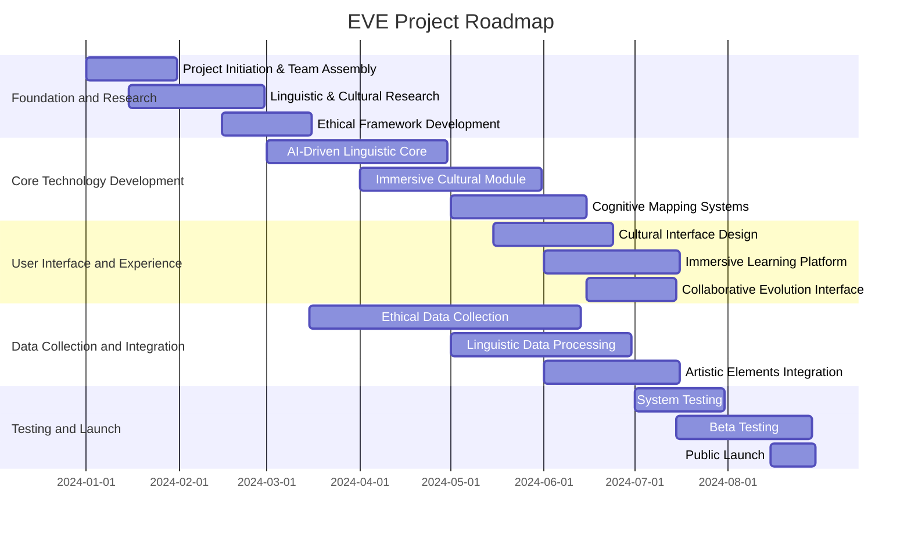

[This dev plan is in alpha, it may change a lot]

# EVE Project (Écosystème linguistique Virtuel Évolutif)

## About EVE

The Evolving Virtual Linguistic Ecosystem (EVE) project is a revolutionary initiative aimed at preserving and evolving human expression in all its diversity. In a world where a language dies every two weeks, EVE stands as a guardian of cognitive and cultural wealth, using cutting-edge technology to safeguard unique ways of perceiving, thinking, and interacting with our environment.

## Objective

Our fundamental goal is to create a dynamic linguistic ecosystem that captures not only words but also the cultural contexts, gestures, tones, and even the silences that give life to a language. We aim to:

- Preserve and revitalize endangered languages
- Create immersive learning experiences
- Facilitate ethical and collaborative linguistic evolution
- Develop a deeper understanding of the relationship between language, culture, and cognition

## Project Roadmap

### Phase 1: Foundation and Research (3 months)

1.1 [Project Initiation and Team Assembly](https://github.com/Git-Fg/Eve_Project/blob/main/DevPlan/Detailed/Step1.md)

1.2 Comprehensive Linguistic and Cultural Research

1.3 Ethical Framework Development

### Phase 2: Core Technology Development (6 months)

2.1 [AI-Driven Linguistic Core Development](https://github.com/Git-Fg/Eve_Project/blob/main/DevPlan/Detailed/Step3.md)

2.2 [Immersive Cultural and Phenomenological Module](https://github.com/Git-Fg/Eve_Project/blob/main/DevPlan/Detailed/Step5.md)

2.3 Cognitive Mapping and Adaptive Systems

### Phase 3: User Interface and Experience Design (4 months)

3.1 [Cultural Interface Development](https://github.com/Git-Fg/Eve_Project/blob/main/DevPlan/Detailed/Step4.md)

3.2 Immersive Learning Platform

3.3 Collaborative Evolution Interface

### Phase 4: Data Collection and Integration (5 months)

4.1 [Ethical Data Collection](https://github.com/Git-Fg/Eve_Project/blob/main/DevPlan/Detailed/Step2.md)

4.2 Linguistic and Cultural Data Processing

4.3 Integration of Artistic and Cultural Elements

### Phase 5: Ethical Governance and Community Engagement (Ongoing)

5.1 [Ethical Oversight Committee](https://github.com/Git-Fg/Eve_Project/blob/main/DevPlan/Detailed/Step6.md)

5.2 [Community Governance Implementation](https://github.com/Git-Fg/Eve_Project/blob/main/DevPlan/Detailed/Step7.md)

5.3 Global Collaboration Network

### Phase 6: Testing, Refinement, and Launch (4 months)

6.1 [Comprehensive System Testing](https://github.com/Git-Fg/Eve_Project/blob/main/DevPlan/Detailed/Step8.md)

6.2 [Beta Testing and Community Feedback](https://github.com/Git-Fg/Eve_Project/blob/main/DevPlan/Detailed/Step9.md)

6.3 [Public Launch and Ongoing Development](https://github.com/Git-Fg/Eve_Project/blob/main/DevPlan/Detailed/Step10.md)

## Key Components

1. Generative and culturally anchored linguistic core
2. Phenomenological and cultural immersion module
3. Adaptive and cognitive contextual system
4. Performative engine and non-verbal communication
5. Cultural and artistic interface
6. Immersive learning and dialectal variation platform
7. Linguistic and cultural ethics laboratory
8. Collaborative evolution and community governance module

## Guiding Principles

1. Cultural authenticity
2. Inclusivity and diversity
3. Ethics and respect
4. Adaptability and vitality
5. Transparency and participation
6. Holistic preservation
7. Linguistic equity

## Get Involved

We invite linguists, technologists, philosophers, and cultural guardians to join us in this extraordinary quest to redefine and enrich our understanding of what it means to be human. Together, we can create a living linguistic tapestry that honors the diversity of human thought.

For more information on how to contribute, please see our [CONTRIBUTING.md](CONTRIBUTING.md) file.

## License

[TODO]

## Contact

[TODO]
