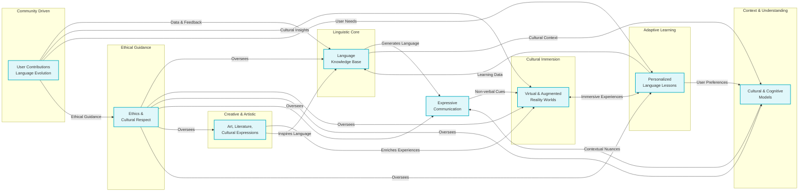
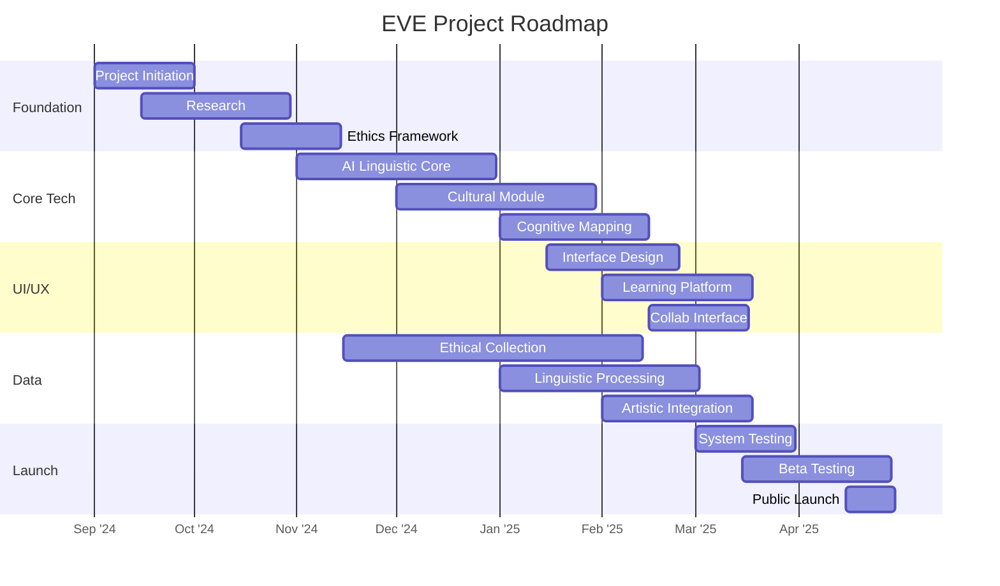

# EVE Project (Écosystème linguistique Virtuel Évolutif)

## About EVE

The Evolving Virtual Linguistic Ecosystem (EVE) project is a revolutionary initiative aimed at preserving and evolving human expression in all its diversity. In a world where a language dies every two weeks, EVE stands as a guardian of cognitive and cultural wealth, using cutting-edge technology to safeguard unique ways of perceiving, thinking, and interacting with our environment.

For a comprehensive overview of the project, visit our [Wiki Home Page](https://github.com/Git-Fg/Eve_Project/wiki/home).

## Objective

Our fundamental goal is to create a dynamic linguistic ecosystem that captures not only words but also the cultural contexts, gestures, tones, and even the silences that give life to a language. We aim to:

- Preserve and revitalize endangered languages
- Create immersive learning experiences
- Facilitate ethical and collaborative linguistic evolution
- Develop a deeper understanding of the relationship between language, culture, and cognition

Learn more about our [Vision and Objectives](https://github.com/Git-Fg/Eve_Project/wiki/Vision-and-Objectives).

## Project Roadmap

[This development plan is in alpha and subject to change]

For a detailed breakdown of our project phases, visit our [[Project Roadmap](https://github.com/Git-Fg/Eve_Project/wiki/Project-Roadmap)] wiki page.

## Key Components

1. Generative and culturally anchored linguistic core
2. Phenomenological and cultural immersion module
3. Adaptive and cognitive contextual system
4. Performative engine and non-verbal communication
5. Cultural and artistic interface
6. Immersive learning and dialectal variation platform
7. Linguistic and cultural ethics laboratory
8. Collaborative evolution and community governance module

Explore our [Project Architecture](https://github.com/Git-Fg/Eve_Project/wiki/Project-Architecture) for more details on these components.

## Guiding Principles

1. Cultural authenticity
2. Inclusivity and diversity
3. Ethics and respect
4. Adaptability and vitality
5. Transparency and participation
6. Holistic preservation
7. Linguistic equity

Read more about our ethical approach in our [Ethical Framework](https://github.com/Git-Fg/Eve_Project/wiki/Ethical-Framework).

## Get Involved

We invite linguists, technologists, philosophers, and cultural guardians to join us in this extraordinary quest to redefine and enrich our understanding of what it means to be human. Together, we can create a living linguistic tapestry that honors the diversity of human thought.

For more information on how to contribute, please see our [Contributing Guidelines](https://github.com/Git-Fg/Eve_Project/wiki/Contributing-Guidelines) and [Community Engagement](https://github.com/Git-Fg/Eve_Project/wiki/Community-Engagement) pages.

## Research and Publications

Stay updated with our latest research and academic contributions on our [Research and Publications](https://github.com/Git-Fg/Eve_Project/wiki/Research-and-Publications) page.

## FAQ

For answers to common questions about the EVE project, visit our [FAQ](https://github.com/Git-Fg/Eve_Project/wiki/FAQ) page.

## License

[TODO: Add license information]

## Contact

[TODO: Add contact information]

For a glossary of terms used in this project, refer to our [Glossary](https://github.com/Git-Fg/Eve_Project/wiki/Glossary) page.
