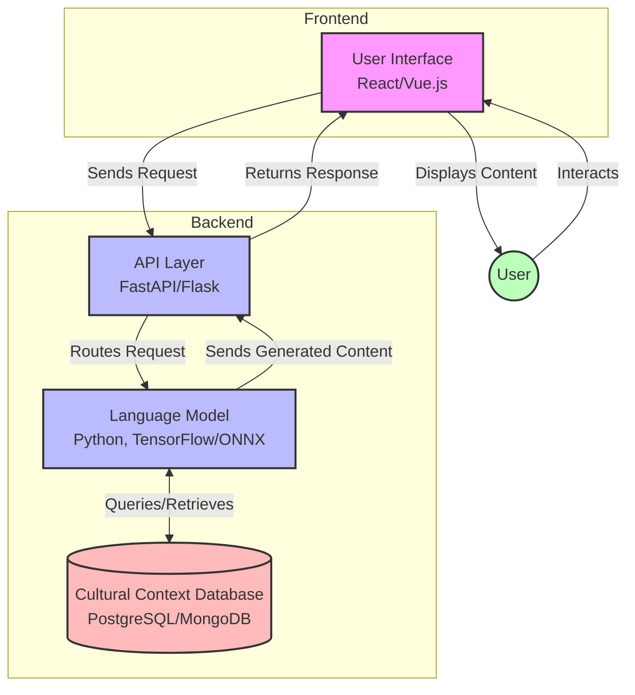

# Technical Architecture

## 1. System Overview

EVE is designed as a modular system comprising four main components: a Language Model, a Cultural Context Database, a User Interface, and an API layer for inter-component communication. The system aims to generate linguistically accurate and culturally sensitive content for endangered languages.

## 2. System Components

### 2.1 Language Model Component
- Responsible for natural language processing and generation
- Utilizes advanced NLP techniques and models (e.g., BERT, GPT, T5)
- Handles multilingual capabilities

### 2.2 Cultural Context Database
- Stores cultural information, idioms, and context for target languages
- Provides data to inform and enrich language generation
- Ensures cultural sensitivity and accuracy

### 2.3 User Interface Layer
- Provides interface for user interactions
- Displays generated content and allows for user input
- Offers language selection and other configuration options

### 2.4 API for Inter-component Communication
- Facilitates communication between all system components
- Manages data flow and requests between frontend and backend
- Ensures modularity and scalability of the system

## 3. Data Flow

1. User interacts with the UI, selecting language and input parameters
2. UI sends request to API
3. API routes request to Language Model
4. Language Model queries Cultural Context Database for relevant information
5. Language Model generates content based on input and cultural context
6. Generated content is sent back through API to UI
7. UI displays the generated content to the user

## 4. Technology Stack

### 4.1 Backend
- Language: Python 3.9+
- Framework: FastAPI or Flask
- Model Serving: TensorFlow Serving or ONNX Runtime

### 4.2 Frontend
- Framework: React or Vue.js

### 4.3 Database
- Cultural Context Database: PostgreSQL or MongoDB

### 4.4 DevOps
- Version Control: Git
- CI/CD: To be determined

## 5. System Architecture Diagram

A visual representation of the system architecture is available as a separate file: `eve_system_architecture.png`. This diagram illustrates the components and their interactions as described in this document.

## 6. Security Considerations

- Implement secure API authentication and authorization
- Ensure data encryption for sensitive cultural information
- Regular security audits and updates

## 7. Scalability and Performance

- Design for horizontal scalability of the Language Model component
- Implement caching mechanisms for frequently accessed cultural data
- Consider load balancing for handling multiple user requests

## 8. Future Considerations

- Integration with external language resources and APIs
- Expansion of supported languages and cultural contexts
- Implementation of user feedback mechanisms for continuous improvement

This technical architecture provides a foundation for the EVE project and will evolve as development progresses.
